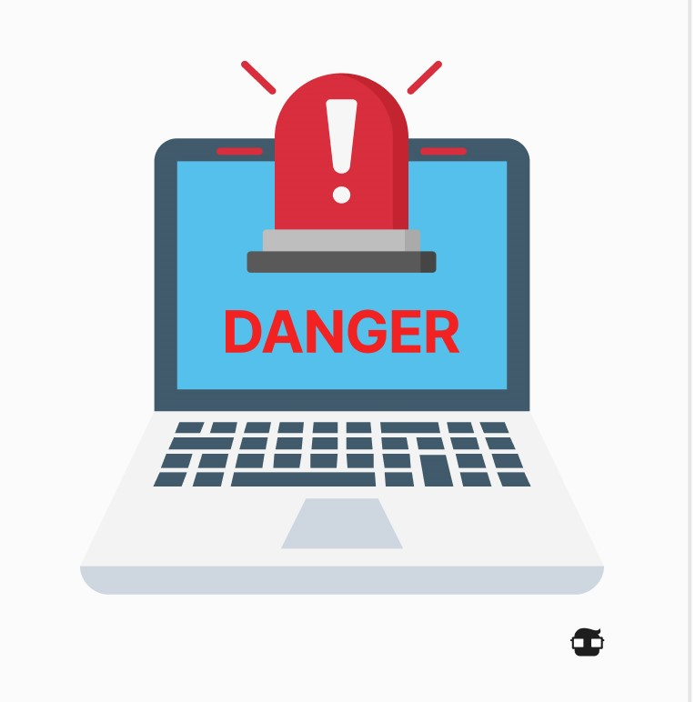
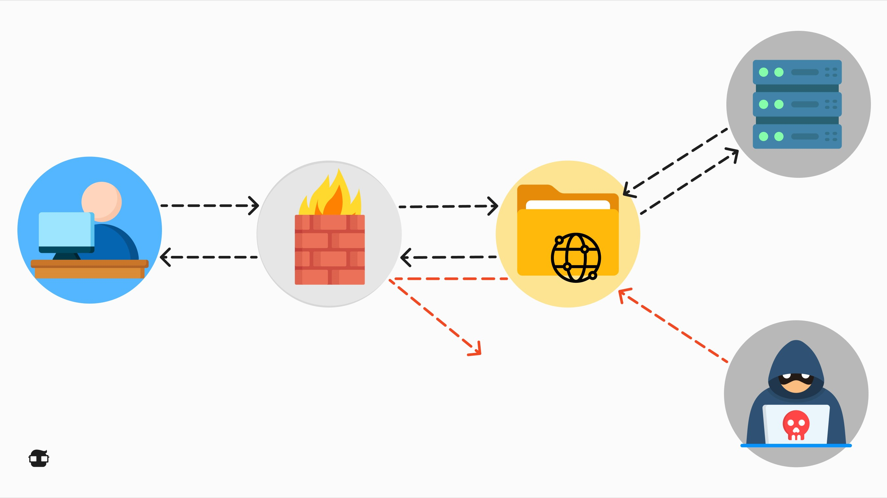

Network security is a critical aspect of cybersecurity that focuses on protecting communication infrastructure and the information flowing through it. It involves a series of measures and practices designed to ensure the confidentiality, integrity, and availability of data in a network environment. Here is continuous text-format information on network security:

Network security covers a variety of aspects and challenges. One of the primary focuses is **authentication**, ensuring that only authorized users have access to network resources. This involves implementing secure passwords, two-factor authentication (2FA), and, in some cases, biometric authentication to verify users' identities.

Another key aspect of network security is **access control**, determining who has permission to access which network resources. The "principle of the least privilege" dictates that users should have access only to the resources necessary to perform their job tasks, minimizing the risk of unauthorized access.

**Threat management in the network** is essential for identifying and mitigating potential risks. This includes intrusion detection and prevention, as well as continuous monitoring of network traffic for unusual or malicious activities. Tools such as Intrusion Detection Systems (IDS) and Intrusion Prevention Systems (IPS) are common in this context.

Security of **data in transit** is fundamental to protecting information while it moves through the network. This is achieved through data encryption, which encodes information in a way that only authorized recipients can decode it. Secure protocols like HTTPS and VPN are used to secure online communication.

Network security also involves protection against specific threats such as malware, viruses, and Denial of Service (DDoS) attacks. This is achieved through the use of antivirus software, firewalls, and the implementation of security policies that include regular software updates and patches.

> In summary, network security is a critical aspect of cybersecurity that focuses on protecting communication infrastructure and information in a network environment. It involves authentication, access control, threat management, and the protection of data in transit, among other aspects, to ensure that networks are secure and reliable in an increasingly digital and connected world.

## **Firewall and Packet Filtering**

A **firewall** and **packet filtering** are key components of network security used to protect a network and its systems against cyber threats.

### **Firewall**

A firewall is a security barrier located between an internal network and an external network, such as the Internet. Its main function is to control network traffic and decide which data packets are allowed or blocked based on a set of predefined rules. Firewalls can be physical devices or software running on servers or routers.

Firewalls serve various purposes, including:

1. **Access Control:** Firewalls determine what network traffic can enter or exit a protected network. This is based on rules that define which IP addresses, ports, and protocols are allowed or blocked.
2. **Protection against Threats:** They help protect a network against cyber threats, such as intrusions, malware, and Denial of Service (DDoS) attacks. They can block malicious or suspicious traffic.
3. **Network Segmentation:** Firewalls are used to divide a network into segments or security zones. This reduces the attack surface and limits the spread of threats within the network.
4. **Logging and Auditing:** Firewalls often have logging capability to record network activities. This is useful for monitoring and reviewing security events.

### Packet Filtering

Packet filtering is a technique used in firewalls and routers to examine and control network traffic at the packet level. Each data packet passing through the packet filtering device is compared against specific rules, and a decision is made on whether to allow or block that packet.

Packet filtering criteria may include:

- Source and destination IP address.
- Port number.
- Transport protocol (e.g., TCP or UDP).
- Content or specific data patterns.

Packet filtering is an effective technique for blocking unwanted or dangerous traffic on the network, but it relies on specific rules and lacks the contextual intelligence of a Next-Generation Firewall (NGFW). NGFWs combine packet filtering with deep packet inspection and advanced security capabilities for more comprehensive protection.

> 📖 In summary, firewalls and packet filtering are essential for network security by controlling and protecting data traffic entering and leaving a network. These technologies help prevent cyber threats and ensure that only legitimate and secure traffic has access to the systems and resources of a protected network.

# VPN (Virtual Private Network)

A **VPN** (Virtual Private Network) is a technology that creates a secure and encrypted connection between two points on a network, often over the Internet. The VPN is used to protect the privacy and security of communication, as well as to securely access network resources, even when using an untrusted network such as the Internet.

### How a VPN Works

1. **Secure Tunnel:** A VPN establishes an encrypted communication tunnel between your device (such as a computer, phone, or tablet) and a VPN server. This tunnel acts as a secure conduit through which data flows.
2. **Data Encryption:** All data sent through the VPN is encrypted before leaving your device and decrypted at the VPN server. This ensures that even if someone intercepts the data in transit, they cannot understand it without the decryption key.
3. **Changed IP Address:** When you connect to a VPN, your real IP address is hidden and replaced with the IP address of the VPN server. This enhances privacy by making your location and identity less traceable.

**Benefits of a VPN**

✅ **Security on Public Networks:** VPNs are ideal for protecting communication on public or insecure Wi-Fi networks, such as those in cafes, hotels, or airports.

✅ **Secure Remote Access:** VPNs allow employees to securely access the company's network from remote locations, facilitating remote work.

✅ **Online Privacy:** A VPN hides your IP address and encrypts your data, making it difficult for advertisers and online trackers to follow you online.

✅ **Access to Restricted Content:** You can use a VPN to access online content that may be geographically blocked in your location.

**Types of VPN:**

| Remote Access VPN | Allows a user to securely connect to the company's network from a remote location. It is useful for employees working from home or on the move. |
| --- | --- |
| Site-to-Site VPN | Connects two entire networks, such as a company's offices in different geographical locations. These VPNs are common in multinational companies. |
| Public Access VPN | Offers VPN services through public service providers. Users can subscribe to these services to protect their online privacy. |
| Layer 2 and Layer 3 VPN | Different types of VPNs can operate at different network layers (such as Layer 2 or Layer 3) and have specific applications based on the organization's needs. |

> 📖 A **VPN** is an essential tool for protecting online privacy and security, as well as for establishing secure connections on public networks or accessing network resources remotely. Its ability to encrypt data and hide IP addresses makes it valuable for both individual users and companies looking to protect the confidentiality of their communications and data.

The key difference between a **VPN** (Virtual Private Network) and a **proxy** is how they handle privacy and security:

| VPN | Proxy |
| --- | --- |
| A VPN creates a secure and encrypted connection between your device and a remote server, hiding your IP address and protecting your data. It is more suitable for privacy and security, ideal for protecting communication on public networks or securely accessing a company's network. | A proxy acts as an intermediary between your device and the web. It can hide your IP address, but generally does not encrypt data. Proxies are useful for accessing geographically restricted content or changing your locationm but may be less secure than a VPN. |

> 💡 Use a VPN when you need a secure and encrypted connection for privacy and security. Use a proxy when you want to change your location or access geographically restricted content but don't need as robust data protection.

## Wi-Fi Security

Wi-Fi security refers to the practices and measures implemented to protect a wireless network (Wi-Fi) from threats and unauthorized access. It is essential to ensure that your Wi-Fi network is adequately secured to prevent intrusions and safeguard the privacy of connected devices and data.

### Key Aspects of Wi-Fi Security

1. **Strong Password:** Use a secure password to protect your Wi-Fi network. Avoid easily guessable passwords and opt for combinations of letters, numbers, and special characters.
2. **Encryption:** Enable encryption on your Wi-Fi router. The most common standard is WPA3 (or WPA2 if WPA3 is not available), which encrypts communication between devices and the router.
3. **Hidden Network Name (SSID):** If possible, hide your network's SSID so that it is not visible to nearby devices. This adds an extra layer of security by making the network less visible to potential attackers.
4. **MAC Address Filtering:** Configure your router to allow only devices with specific MAC addresses. While not a foolproof security measure, it can add a layer of protection.
5. **Firmware Updates:** Keep your router's firmware up to date. Updates often include security fixes that protect against known vulnerabilities.
6. **Guest Network:** If your router supports it, create a separate guest network for visitors. This prevents guest devices from having full access to your main network.
7. **Change Default Passwords:** Change the default passwords for the router and administrator accounts. Default passwords are known to cybercriminals.

**Use Cases and Recommendations:**

✅ At home, ensure that your Wi-Fi network is protected with a strong password and appropriate encryption. Limit access only to authorized devices.

✅ In business environments, use user authentication and robust encryption. Consider implementing separate networks for employees and visitors.

✅ If you need remote access to your network, use a VPN for a secure connection from outside your local network.

✅ Conduct regular security audits of your Wi-Fi network to identify potential vulnerabilities and enhance protection.

### Best Practices

1. **WPA3/WPA2 Encryption:** Use WPA3 or WPA2 encryption on your Wi-Fi network. These security protocols encrypt communication between devices and the router. Avoid using WEP, which is less secure.
2. **Strong Passwords:** Configure strong passwords for both Wi-Fi network access and the router's administration panel. Avoid default or weak passwords.
3. **Firmware Updates:** Keep the router's firmware up to date. Updates often include security fixes that protect against known vulnerabilities.
4. **Guest Network:** If possible, set up a separate guest network with internet access but without access to the main network. This limits the exposure of the main network to untrusted devices.
5. **Monitoring and Auditing:** Implement monitoring tools and regularly conduct security audits on the Wi-Fi network. This will help detect and mitigate potential threats and vulnerabilities.

> 📖 Security on the router and switch is essential to protect a home or business network against cyber threats and ensure safe and reliable operation. Remember that network devices also play a role in the cybersecurity landscape:

### Router Security

1. **Strong Passwords:** Change default router passwords and set strong passwords for access to the administration panel. Avoid using easily guessable information, such as names or birthdates.
2. **Firmware Updates:** Keep the router firmware up to date. Manufacturers often release security updates that fix known vulnerabilities.
3. **Firewall:** Enable the built-in firewall on the router to filter unwanted traffic and block potential threats. Configure firewall rules according to your needs.
4. **Disable Unnecessary Services:** Turn off any service or port that you don't need. The fewer enabled services, the fewer chances of exploiting vulnerabilities.
5. **Secure Remote Access:** If you enable remote access to the router, do it securely using a VPN or other strong authentication measures. Limit access only to authorized IP addresses.

### Switch Security

1. **VLAN (Virtual LAN):** Use VLAN to segment the network into logical groups. This enhances security by limiting communication between devices and restricting access to critical areas of the network.
2. **Port-Based Access Control:** Configure the switch to limit access to specific ports. This prevents unauthorized devices from connecting to the network.
3. **Traffic Monitoring:** Implement traffic monitoring tools to detect unusual or unauthorized activities on the network. This facilitates the detection of potential threats.
4. **Firmware Updates:** Like routers, keep the switch firmware updated to benefit from security fixes.
5. **802.1X Authentication:** Use standard 802.1X-based authentication to control network access. It requires devices to authenticate before allowing them to connect.

> 📖 Together, these practices help strengthen security on the router and switch, forming a robust defense against cyber threats and providing a safer and more reliable network environment.
