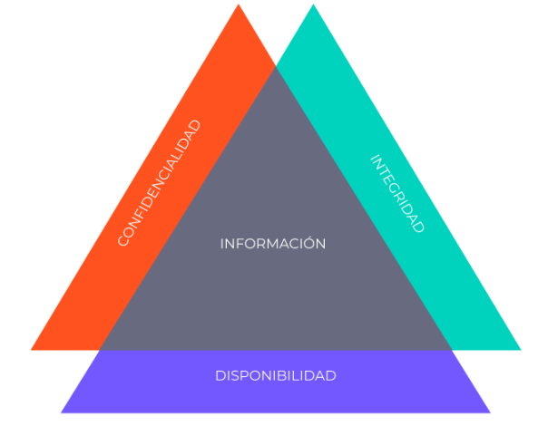

La ciberseguridad engloba una serie de prácticas que a menudo se confunden con el hacking, así que salgamos de la duda. La **ciberseguridad** es un conjunto de prácticas interdisciplinarias que engloba la seguridad de la información, la seguridad de los datos, la privacidad, la infraestructura segura, políticas y regulaciones y por supuesto, el hacking. Es decir, la ciberseguridad es el universo en el que todas estas prácticas son posibles. Cada disciplina mencionada anteriormente es un planeta en este gran universo llamado ciberseguridad.

Habitualmente la ciberseguridad es erróneamente confundida con el *hacking*, y es que el hacking forma parte de la ciberseguridad, pero la ciberseguridad es una caja llena de múltiples disciplinas como las mencionadas anteriormente, y por tanto, un profesional en ciberseguridad puede desempeñar diversos roles como: Analista SOC, pentester, analista de ciberseguridad, administrador de sistemas, analista de malware, analista de riesgos entre otros. 

## ¿Por qué la ciberseguridad es importante en una empresa?

Las empresas emiten facturas de miles o millones de dólares todos los días, imagina que eres un ejecutivo de ventas, llegas un día a la oficina y… ¡La empresa está bajo ataque! La empresa para la que trabajas ha sido víctima de ciberdelincuentes y ahora no tienes acceso al sistema de ventas ¿cuánto dinero crees que se pierde a diario mientras este ataque se está ejecutando? ¿cuántos clientes podrías perder? ¿cuántas ventas podrían verse afectadas? ¿cuánta información de clientes, proveedores y empleados puede verse comprometida? Respondiendo a estas preguntas encuentras el valor de la ciberseguridad en una empresa. El principal activo de una empresa es su información ¡La información lo es todo! La información permite ejecutar procesos, permite las comunicaciones, las ventas y mucho más. 

### Implementando cultura de ciberseguridad en las empresas podemos lograr:

1. **Protección de datos sensibles**: Las empresas manejan una gran cantidad de datos confidenciales, como información financiera, datos de clientes, secretos comerciales y propiedad intelectual. La falta de seguridad podría poner en riesgo estos activos críticos, lo que podría resultar en pérdidas financieras, daño a la reputación y sanciones legales.
2. **Cumplimiento normativo**: Muchos sectores y jurisdicciones tienen regulaciones estrictas sobre la protección de datos y la privacidad de los clientes. Las empresas que no cumplen con estas regulaciones pueden enfrentar multas significativas y otros problemas legales. La ciberseguridad efectiva es esencial para garantizar el cumplimiento normativo.
3. **Continuidad del negocio**: Las amenazas cibernéticas, como los ataques de ransomware, pueden paralizar las operaciones de una empresa. Esto puede resultar en pérdida de ingresos, interrupción de servicios y daños a la relación con los clientes. La ciberseguridad ayuda a garantizar la continuidad del negocio al minimizar el impacto de tales incidentes.
4. **Protección de la reputación**: Una violación de la seguridad puede dañar la reputación de una empresa y la confianza de los clientes. Los consumidores son cada vez más conscientes de la importancia de la seguridad de sus datos y pueden evitar hacer negocios con empresas que no toman medidas adecuadas para proteger la información.
5. **Costos financieros**: La recuperación de un ataque cibernético puede ser costosa. Esto incluye no solo los costos directos de mitigación y recuperación, sino también los costos indirectos relacionados con la pérdida de ingresos y la inversión en seguridad después del incidente.
6. **Amenazas en constante evolución**: Los ciberdelincuentes están en constante evolución, desarrollando nuevas técnicas y herramientas para eludir las defensas tradicionales. Mantenerse al día con estas amenazas requiere una inversión continua en ciberseguridad.
7. **Protección de la cadena de suministro**: Las empresas a menudo dependen de proveedores y socios comerciales para sus operaciones. La falta de seguridad en la cadena de suministro puede exponer a la empresa a riesgos adicionales. La ciberseguridad ayuda a proteger toda la red de relaciones comerciales.
8. **Resiliencia organizativa**: La ciberseguridad no se trata solo de prevenir ataques, sino también de tener la capacidad de responder y recuperarse rápidamente cuando ocurren incidentes. Esto incluye la planificación de respuesta a incidentes y la implementación de medidas de recuperación.

> 👉 La ciberseguridad es esencial en una empresa para proteger sus activos, garantizar la confianza de los clientes, cumplir con regulaciones, mantener la continuidad del negocio y evitar costos significativos asociados con posibles ataques cibernéticos. Es una inversión crítica en la era digital actual.

## Los tres pilares de la ciberseguridad

En la ciberseguridad existen tres pilares: **Confidencialidad**, **disponibilidad e integridad**. Tu deber como profesional es proteger esos pilares como un objeto muy valioso.

1. **Confidencialidad:**

    - La confidencialidad se refiere a la **capacidad** de proteger la información para que solo las personas autorizadas puedan acceder a ella. Esto significa que la información confidencial no debe estar al alcance de personas no autorizadas o entidades externas.
    - La confidencialidad se logra mediante el uso de técnicas como el cifrado de datos, la autenticación de usuarios y la gestión de accesos. El objetivo es garantizar que solo aquellos que tienen permiso para ver ciertos datos puedan hacerlo, manteniendo los datos seguros y protegiendo la privacidad.
    - La confidencialidad hace referencia a que la información solo esté disponible para aquellos que la necesitan. Por ejemplo, si eres un ejecutivo de ventas necesitas información sobre productos y clientes pero no necesitas información sobre las versiones y configuración de los servidores de la empresa. La confidencialidad garantiza que la información que reciba cada persona sea la correcta para evitar fugas de información que puedan comprometer a la empresa y perpetuar un ciberataque.

2. **Disponibilidad:**

    - La disponibilidad se refiere a **garantizar** que la información y los recursos estén disponibles y accesibles cuando se necesiten. Esto significa que los sistemas y datos críticos deben estar disponibles para su uso en todo momento, sin interrupciones no planificadas.
    - Para garantizar la disponibilidad, se implementan medidas de seguridad y planes de recuperación ante desastres para prevenir y mitigar interrupciones, como: ataques cibernéticos, fallos de hardware, desastres naturales, etc.

3. **Integridad:**

    - La integridad se relaciona con la exactitud y la confiabilidad de la información. Se refiere a la garantía de que los datos no han sido alterados de manera no autorizada y que siguen siendo precisos y completos.
    - Para proteger la integridad de los datos, se utilizan técnicas como el control de cambios, firmas digitales y registros de auditoría. Estas medidas ayudan a detectar y prevenir modificaciones no autorizadas de datos, lo que podría conducir a decisiones erróneas o acciones incorrectas.
    

En conjunto, la confidencialidad, la disponibilidad y la integridad forman un marco sólido para la seguridad de la información. Estos principios guían la implementación de políticas, procedimientos y tecnologías de seguridad que ayudan a proteger los activos de información de una organización y a mantener la confianza de los clientes y las partes interesadas. Además, son esenciales para cumplir con las regulaciones de privacidad y seguridad de datos en diversas industrias y jurisdicciones.

## ¿Qué pueden hacer con mis datos?

Los datos te identifican como individuo único. Eres la única persona en el mundo con tus huellas dactilares (datos biométricos), los números que tienes en tu tarjeta del banco también son únicos, también tu número telefónico, correo electrónico y número de identificación de tu país. Si esta información se ve comprometida podrías estar en serios problemas. Un hacker malicioso podría usar tu información para suplantar tu identidad y de esta manera abrir una cuenta bancaria a tu nombre, solicitar préstamos, ayudas sociales, hacer compras, podría usar tu identidad para hostigar a otras personas en internet y cometer delitos en tu nombre, también podría incluso extorsionarte para conseguir algún beneficio. La pérdida de la confidencialidad de tu información tiene consecuencias personales, reputacionales y económicas para ti.

Una forma común de robo de información es el **phishing**, un ciberataque con el que ya tuviste un primer encuentro. Si no pudiste detectarlo, el phishing tiene características que puedes detectar si pones atención.

## ¿Quién puede ser el atacante detrás de la pantalla?

El actor malicioso detrás de la pantalla puede ser un completo desconocido pero aunque sea difícil de creer tu atacante también podría ser un conocido, amigo o incluso un familiar. Una persona que te conoce lo suficiente y que tiene motivos para hacerte daño podría atacarte cibernéticamente pero los hackers maliciosos no necesitan conocerte para obtener beneficio de ti, son expertos en conseguir rápidamente información de valor que pueden convertir en dinero. Pero además temas como la venganza, la envidia o la competencia desleal pueden llevar a una persona a actuar en tu contra aunque no obtenga ningún beneficio económico.

Tal vez piensas que no tienes enemigos o que tu información no es lo suficientemente relevante como para que alguien la quiera. Eres una persona normal que va a la universidad o trabaja medio tiempo, con amigos normales con los que sales de vez en cuando  y que no tiene nada interesante o atractivo para un atacante pero te sorprenderías de la cantidad de datos que salen de ti misma sin que te des cuenta y con los que un atacante puede perfilarte y obtener un beneficio. No es necesario que seas una persona altamente influyente o con mucho dinero para que un atacante se fije en ti y de hecho, las personas “corrientes” son los blancos más fáciles debido a que creen erróneamente que su información no tiene ningún tipo de valor ¿no lo crees? conoce estos ejemplos basados en casos reales.

**A continuación veamos algunos posibles casos de ataques:**

- **Caso 1:**

Elena y Leticia compiten arduamente por el mejor promedio de la universidad el cual depende de la entrega de una tarea de forma online en la plataforma de la casa de estudios. Se sabe que la plataforma utiliza el correo electrónico de los estudiantes por default como usuario para ingresar al sistema y el número de identificación ciudadana como contraseña. Elena que es muy astuta y conoce esta información por default, consigue los datos de Leticia durante un desayuno en la cafetería, accede a la plataforma de la universidad con la identidad de Leticia y borra todas sus tareas. **Elena consigue el mejor promedio perjudicando a Leticia**.

**¿Qué ocurrió?:** Las credenciales de acceso por default siempre deben ser modificadas para evitar este tipo de situaciones. Leticia debió cambiar su contraseña.

- **Caso 2:**

Laura está comprando un regalo para su pareja en un marketplace online poco conocido que descubrió a través de publicidad en redes sociales con precios muy atractivos. Al momento de finalizar la compra, Laura suministra su dirección para el envío, datos fiscales y datos de su tarjeta de crédito,  según la plataforma el pago fue procesado exitosamente y todo marcha bien. **La tarjeta de crédito de Laura fue clonada y utilizada de forma fraudulenta.** El atacante utilizó su tarjeta para hacer compras no autorizadas para sí mismo.

**¿Qué ocurrió? -** El marketplace online en el que Laura estuvo navegando no era legítimo, era un sitio web falso promocionado para atraer personas y robar sus datos para que el atacante pueda hacer compras en nombre de las víctimas. 

- **Caso 3**:

Fernanda se acaba de mudar a una nueva ciudad y está en búsqueda de amigos mediante una aplicación. Empieza a entablar amistad con un chico que antes de conocerla en persona le pide una suma dinero para solventar un problema personal bajo promesa de pronto pago, inmediatamente después Fernanda fue bloqueada del perfil del chico. **Fernanda fue víctima de un ataque por ingeniería social.**

**¿Qué ocurrió?** - La ingeniería social es una de las prácticas favoritas de los atacantes en la red, el chico con el que Fernanda entablaba una conversación no era real y se trataba de un atacante en búsqueda de dinero.

- **Caso 4:**

Oscar acaba de adquirir un nuevo celular, al pasar toda la información de su antiguo dispositivo al nuevo, Oscar olvida configurar una contraseña y la protección contra robo. Días después es asaltado en la calle y el delincuente roba su dispositivo. Oscar recibe llamadas telefónicas y correos electrónicos constantemente con amenazas sobre divulgar su información si no realiza un pago al delincuente.

**¿Qué ocurrió? -** Los teléfonos inteligentes tienen múltiples filtros de seguridad y protección contra robo y debe ser una de las primeras configuraciones que hagas cuando adquieres un nuevo dispositivo además de tomar medidas con las sesiones de tus aplicaciones y tus contraseñas, Mariana fue víctima de extorsión. 

> ⚠️ Todas las personas  mencionadas anteriormente fueron víctimas de un ciberataque y esto podría pasarte a ti también, estos casos son muy comunes y no necesitas ser una persona reconocida para ser una víctima.

Llevando todo lo anterior mencionado a un contexto empresarial, imagina todo el valor de la información en masas que posee una empresa y todo lo que puede ocurrir si esta información cae en las manos equivocadas e inescrupulosas de un atacante cibernético. Incluso un candidato, empleado o ex empleado descontento podría perpetuar un ciberataque contra la empresa o facilitar información a un atacante. Muchas  veces, los ciberataques comienzan fuera de las computadoras. 

## ¿Qué es un ciberataque?

Se entiende por **ciberataque**, cualquier acción realizada intencionalmente que rompa uno o más de los tres pilares que defiende la ciberseguridad. Un ciberataque es un intento deliberado de comprometer la seguridad de sistemas informáticos, redes, dispositivos o datos, con el objetivo de causar daño, robar información confidencial, interrumpir operaciones normales o lograr algún otro objetivo malicioso. Los ciberataques pueden ser realizados por individuos, grupos organizados o incluso naciones, y se llevan a cabo utilizando una variedad de técnicas y herramientas.

Existen **amenazas**, **incidentes** y **ciberataques**. Cada uno tiene un concepto diferente que no se debe confundir:

| Amenaza | Se refiere al canal por el que puede ser posible un ciberataque. Un ejemplo de amenaza sería tener el software obsoleto o una red WiFi sin contraseña |
| --- | --- |
| Incidente | Se refiere a un accidente cibernético que ocasiona un desastre pero que no fue ejecutado intencionalmente.  |
| Ciberataque | Toda acción cometida intencionalmente que comprometa uno o más de los tres pilares de la ciberseguridad |