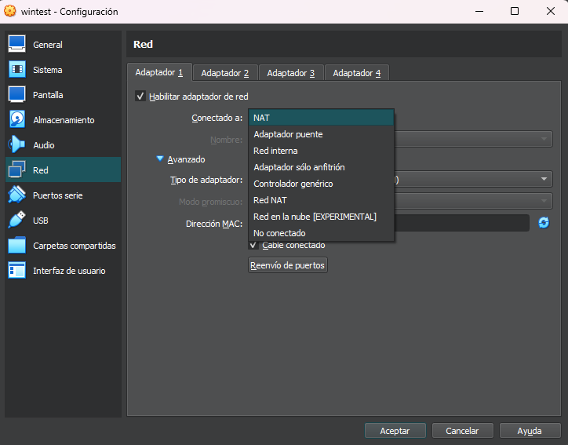
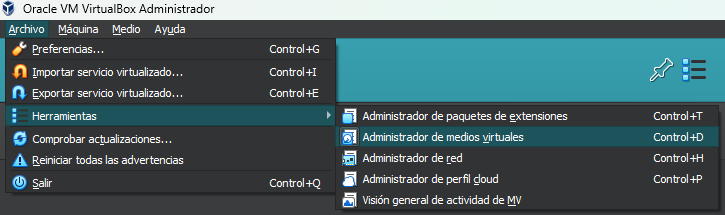
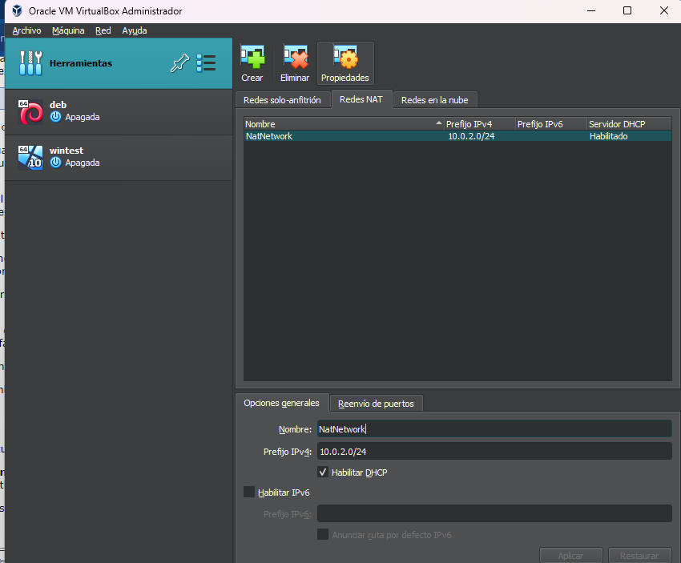
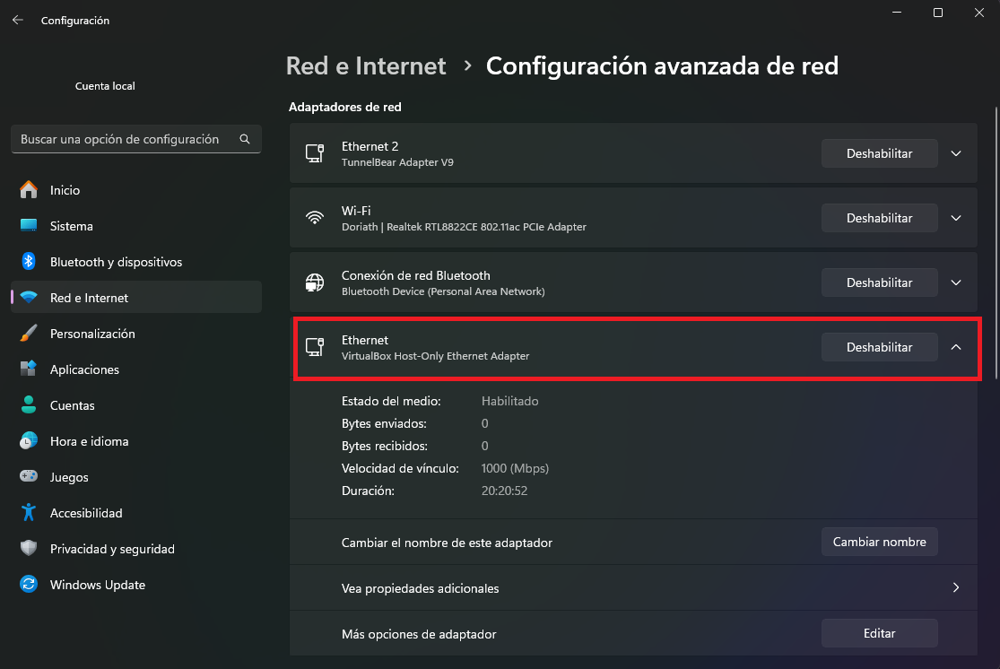

## Virtual Interfaces

VirtualBox is a powerful tool that allows us to run operating systems completely, from the comfort of a window on our computer, as if it were another application. While this is very useful when exploring unfamiliar operating systems or experimenting with the options we already know, it is also very useful when studying how these operating systems can interact with each other or with other computers on our network.

This is where VirtualBox virtual machines offer a variety of interfaces that can be added to the machines to interact in particular ways, depending on the scenario we want to simulate. You will be able to create an internal network between your virtual machines, with or without access to the rest of the network, among other things.

## NAT (Network Address Translation)

NAT is a service that, as its acronym indicates, translates private IP addresses into a public one that can connect to the Internet. This is what allows a home or office network to have internet connection for many computers with private addresses, using a single public address for all of them. While this saves IP addresses, it comes with the limitation of not being able to receive spontaneous connections directly from outside the network to one of the internal devices. To achieve this, other technologies (such as proxies) must be used if these requests are to be fulfilled, which is why public addresses are a highly sought-after commodity in the technology and networking arena.

Imagine that your building is a network and each apartment in it is like a device. NAT is like the building's doorman. Outside (Internet) friends can't directly enter your apartment, but they can talk to the doorman. In the same way, when an inhabitant needs to leave, the doorman opens the door to the outside and identifies him on his return to let him in.

### What is NAT for?

- Saving IP addresses: There are far fewer public IP addresses than there are devices in the world. NAT allows multiple devices to share a single public IP address.
- Security: NAT helps protect your network from intruders by blocking spontaneous access to devices within the network by default.
- Privacy: NAT hides the private IP addresses of your devices from the Internet.

## Connections in VirtualBox

From the configuration window of a virtual machine in VirtualBox, we can activate up to 4 network interfaces. Each of these interfaces can emulate a specific adapter and connect to one of the available options.

## NAT connection

This interface uses a private IP on your virtual machine, with translation to the host computer's network. This allows you to access the internet from the VirtualBox computer using the host computer's network, but without exposing the virtual machine to external connections. It is ideal if you just want to access the internet from the host machine without further complication. This is the default connection mode.

## NAT networks

If in addition to connecting to the Internet, you also want communication between different virtual machines, you can use a NAT network. You can even create several networks to use on different machines as you see fit.

To create NAT networks you must go to the menu `File > Tools > Network Manager`.

Once there you can go to the `NAT Networks` tab and create as many networks as you need. For each of them you can configure the IP addresses to be used, as well as port forwarding from the host computer to a guest.

## Bridged Interface

This connection uses one of the host system interfaces directly to connect to the network. In this case the virtual machine bypasses the restrictions of the host system and appears on the network as another device. It is a useful option if you want to provide a service from a virtual server to the rest of the network.

## Internal Network

This is a virtual network that allows a group of virtual machines to connect privately. This network hides the guest machines from the entire network and host system applications.

## Host Only network

It is similar to an internal network in that it is a private connection between virtual machines, but with the exception that the host system has access to the network. In the case of the host, a virtual interface is installed that will be connected together with the other virtual machines in this network. By default this network is isolated from the external network, so if such connections are needed, additional techniques such as bridging or NAT connections must be used.

Host-only networks must also be created in the VirtualBox network manager window and are located in the tab next to “Nat Networks”. In the interfaces of your computer you will see the interface that is networked as another adapter in your system.

## Versatility in VirtualBox

With these options we can simulate different scenarios in VirtualBox, from a data center with several virtual servers that receive external connections, to a simple client-server architecture with one machine for each role. The most relevant limitation is the capacity of your computer to run several virtual machines, other than that it is more than enough to have a good virtual lab on your computer.