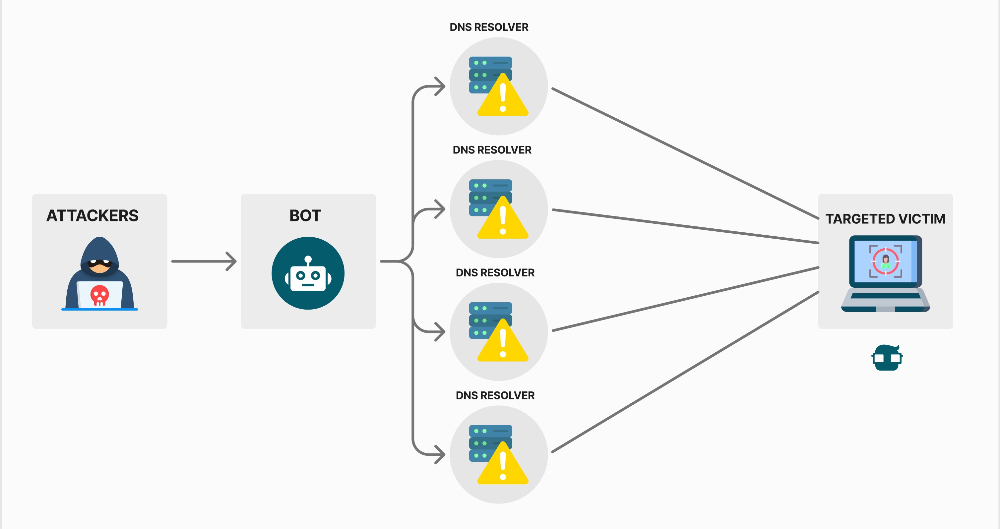
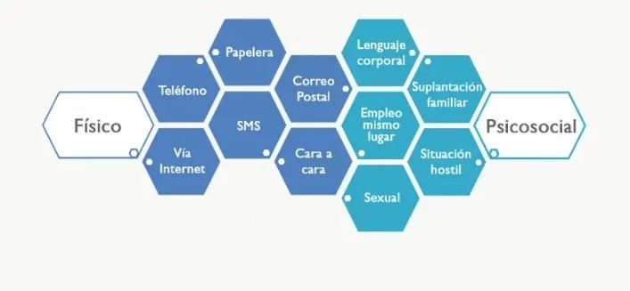
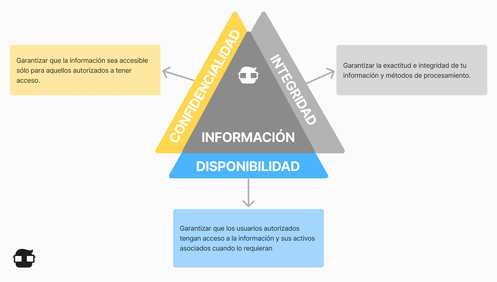
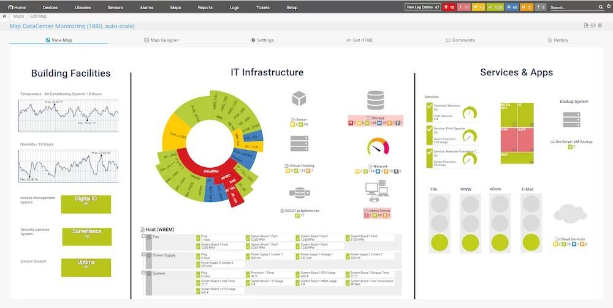

### **¿Quién más quiere mis datos?**

Tu proveedor de Internet (ISP) Tu ISP hace un seguimiento de tu actividad en línea y, en algunos países, puede vender estos datos a los anunciantes con fines de lucro. En ciertas circunstancias, es posible que los ISP tengan la obligación legal de compartir tu información con las agencias o autoridades de vigilancia del gobierno.

- **Anunciantes:** La publicidad dirigida forma parte de la experiencia de Internet. Los anunciantes monitorean y rastrean tus actividades en línea, como los hábitos de compra y las preferencias personales, y envían anuncios dirigidos a tu manera.
- **Motores de búsqueda y plataformas de redes sociales:** Estas plataformas recopilan información sobre tu género, geolocalización, número de teléfono e ideologías políticas y religiosas en función de tus historiales de búsqueda y tu identidad en línea. Luego, esta información se vende a los anunciantes con fines de lucro.
- **Sitios web que visita:** Los sitios web utilizan cookies para rastrear sus actividades con el fin de brindar una experiencia más personalizada. Pero esto deja un rastro de datos que está vinculado a tu identidad en línea que a menudo puede terminar en manos de los anunciantes.

Es obvio que los ciberdelincuentes son cada vez más sofisticados en tu búsqueda de datos personales valiosos. Pero también representan una enorme amenaza para los datos de la organización.

Veamos diferentes tipos de ataque que peuden poner en riesgo las disponibilidad, la integridad y la confidencialidad.

Es extensa la lista de los **tipos de ciberataques** porque existen miles de variantes. No obstante, te daremos a conocer los más comunes a los que diversas industrias se enfrentan día a día.

### **Ransomware o “secuestro de datos”**

Dentro de los tipos de ciberataques, el *ramsomware* es un malware encriptado para rechazar el acceso a los recursos, tales como los archivos de usuario con el fin de obligar al propietario del sistema infectado a pagar una especie de “rescate” con el fin de recuperar el acceso a los recursos cifrados.

Este ejemplo de ciberataque es uno de los más comunes; además de la encriptación de los datos, también se utilizan técnicas de extorsión, ya que si no se paga el monto establecido los piratas informáticos amenazan con exponer información confidencial.

### **Malware o “software malicioso”**

Como lo vimos antes, el *ramsomware* sólo es una parte de esta gran familia de código malicioso utilizado en los ciberataques. Este puede ser usado para diversos propósitos:

- Robo de información
- Alteración de contenido
- Daño de un sistema informático de forma permanente

**Entre los tipos de malware más comunes podemos encontrar los siguientes:**

- ***Botnet malware:*** Se utilizan para actividades delictivas y funcionan a través de una *botnet* en donde se instalan sistemas infectados.
- ***Cryptominers:*** Adquisición de criptomonedas desde la computadora de la víctima.
- ***Troyanos bancarios:*** Extraen información y credenciales de instituciones financieras, o de los usuarios, con el objetivo de robar o transferir recursos de manera electrónica.
- ***Mobile*** ***malware:*** Mediante aplicaciones móviles, se instala código malicioso.
- ***Rootkits***: Se instala en los dispositivos con el objetivo de dar control total al atacante.
- ***Adware***: Presentación de anuncios para obtener información o instalar algún software malicioso.

## **Phishing**

Los correos electrónicos de phishing pueden ser difíciles de detectar. Por ejemplo, a menudo se dirigirán a vos por tu nombre para parecer legítimos, pero los ciberdelincuentes pueden encontrar fácilmente esta información en Internet. Por lo tanto, es importante mantenerse alerta y pensar antes de hacer clic. El phishing es muy común y, a menudo, funciona. Por ejemplo, en agosto de 2020, la marca de juegos de élite Razer sufrió una violación de datos que expuso la información personal de aproximadamente 100 000 clientes.

Un consultor de seguridad descubrió que un clúster en la nube (un grupo de servidores vinculados que proporcionan almacenamiento de datos, bases de datos, redes y software a través de Internet) estaba mal configurado y expuso un segmento de la infraestructura de Razer a la Internet pública, lo que provocó una fuga de datos. Razer tardó más de tres semanas en proteger la instancia en la nube del acceso público, tiempo durante el cual los ciberdelincuentes tuvieron acceso a la información de los clientes que podría haberse utilizado en ataques de ingeniería social y fraude, como la que acaba de descubrir.

Los correos electrónicos de phishing pueden ser difíciles de detectar. Por ejemplo, a menudo se dirigirán por tu nombre para parecer legítimos, pero los ciberdelincuentes pueden encontrar fácilmente esta información en Internet. Por lo tanto, es importante mantenerse alerta y pensar antes de hacer clic. El phishing es muy común y, a menudo, funciona. Por ejemplo, en agosto de 2020, la marca de juegos de élite Razer sufrió una violación de datos que expuso la información personal de aproximadamente 100 000 clientes.

Un consultor de seguridad descubrió que un clúster en la nube (un grupo de servidores vinculados que proporcionan almacenamiento de datos, bases de datos, redes y software a través de Internet) estaba mal configurado y expuso un segmento de la infraestructura de Razer a la Internet pública, lo que provocó una fuga de datos.

Razer tardó más de tres semanas en proteger la instancia en la nube del acceso público, tiempo durante el cual los ciberdelincuentes tuvieron acceso a la información de los clientes que podría haberse utilizado en ataques de ingeniería social y fraude, como la que acaba de descubrir. Por lo tanto, las organizaciones deben adoptar un enfoque proactivo de la seguridad en la nube para garantizar que los datos confidenciales estén protegidos.

## **Denegación de servicio**

### **Los ataques de denegación de servicio (DoS)**

son un tipo de ataque de red que es relativamente sencillo de llevar a cabo, incluso por parte de un atacante no cualificado. Un ataque DoS da como resultado cierto tipo de interrupción del servicio de red a los usuarios, los dispositivos o las aplicaciones.

- **Cantidad abrumadora de tráfico:** Esto es cuando se envía una gran cantidad de datos a una red, a un host o a una aplicación a una velocidad que no pueden procesar. Esto ocasiona una disminución de la velocidad de transmisión o respuesta o una falla en un dispositivo o servicio.
- **Paquetes malicioso formateados:** Un paquete es una colección de datos que fluye entre una computadora o aplicación de origen y una receptora a través de una red, como Internet. Cuando se envía un paquete con formato malicioso, el receptor no puede manejarlo. Por ejemplo, si un atacante reenvía paquetes que contienen errores o paquetes formateados incorrectamente que no pueden ser identificados por una aplicación, esto hará que el dispositivo receptor funcione muy lentamente o se bloquee. Los ataques de DoS se consideran un riesgo importante porque pueden interrumpir fácilmente la comunicación y causar una pérdida significativa de tiempo y dinero.
- **DoS distribuido:** Un ataque DoS distribuido (DDoS) es similar a un ataque DoS pero proviene de múltiples fuentes coordinadas. Por ejemplo:
    - Un atacante crea una red (botnet) de hosts infectados llamados zombies, que son controlados por sistemas de manejo.
    - Las computadoras zombis constantemente analizan e infectan más hosts, creando más y más zombis.
    - Cuando está listo, el hacker proporciona instrucciones a los sistemas manipuladores para que los botnet de zombies lleven a cabo un ataque de DDoS.

## **Ingeniería social:**

Es la manipulación a las personas para que realicen acciones o divulguen información confidencial. Los ingenieros sociales con frecuencia dependen de la disposición de las personas para ayudar, pero también se aprovechan de sus vulnerabilidades. Por ejemplo, un atacante llamará a un empleado autorizado con un problema urgente que requiere acceso inmediato a la red y apelará a la vanidad o la codicia del empleado o invocará la autoridad mediante el uso de técnicas de eliminación de nombres para obtener este acceso.

**¿Cómo funciona la ingeniería social?**

**Tipos de Ingeniería Social**

Ataques en 2 niveles:

**¿Cómo protegernos?**

- Concientizar a las personas y educar sobre seguridad
- Fomentar la adopción de medidas preventivas;
- Nunca divulgar información sensible con desconocidos o en lugares públicos;
- Implementar políticas de seguridad en la organización
- Efectuar controles de seguridad fisica para reducir el peligro inherente a las personas;
- Realizar auditorías y hacer ingeniería social para detectar huecos de seguridad de esta naturaleza.

## Medidas de seguridad para la seguridad de los datos

### **Ingeniería de la seguridad de datos**

**Pensar en seguridad de datos y construir defensas desde el primer momento es de vital importancia**. Los ingenieros de seguridad tienen como objetivo proteger la red de las amenazas desde su inicio hasta que son confiables y seguras. **Los ingenieros de seguridad diseñan sistemas que protegen las cosas correctas de la manera correcta. Si el objetivo de un ingeniero de software es asegurar que las cosas sucedan, el objetivo del ingeniero de seguridad es asegurar que las cosas (malas) no sucedan** diseñando, implementando y probando sistemas completos y seguros.

La ingeniería de seguridad cubre mucho terreno e incluye muchas medidas, **desde pruebas de seguridad y revisiones de código regulares hasta la creación de arquitecturas de seguridad y modelos de amenazas** para mantener una red bloqueada y segura desde un punto de vista holístico.

### **Encriptación**

Si la ingeniería de seguridad de datos protege la red y otros activos físicos como servidores, computadoras y bases de datos, **la encriptación protege los datos y archivos reales almacenados en ellos o que viajan entre ellos a través de Internet**. Las estrategias de encriptación son cruciales para cualquier empresa que utilice la nube y son una excelente manera de proteger los discos duros, los datos y los archivos que se encuentran en tránsito a través de correo electrónico, en navegadores o en camino hacia la nube.

En el caso de que los datos sean interceptados, la encriptación dificulta que los hackers hagan algo con ellos. Esto se debe a que **los datos encriptados son ilegibles para usuarios no autorizados sin la clave de encriptación**. La encriptación no se debe dejar para el final, y debe ser cuidadosamente integrada en la red y el flujo de trabajo existente para que sea más exitosa.

### **Detección de intrusión y respuesta ante una brecha de seguridad**

Si en la red ocurren acciones de aspecto sospechoso, como alguien o algo que intenta entrar, la detección de intrusos se activará. **Los sistemas de detección de intrusos de red (NIDS) supervisan de forma continua y pasiva el tráfico de la red en busca de un comportamiento que parezca ilícito o anómalo y lo marcan para su revisión**. Los NIDS no sólo bloquean ese tráfico, sino que **también recopilan información sobre él y alertan a los administradores de red**.

Pero a pesar de todo esto, las brechas de seguridad siguen ocurriendo. Es por eso que **es importante tener un plan de respuesta a una violación de datos**. Hay que estar preparado para entrar en acción con un sistema eficaz. Ese sistema se puede actualizar con la frecuencia que se necesite, por ejemplo si hay cambios en los componentes de la red o surgen nuevas amenazas que deban abordarse. **Un sistema sólido contra una violación garantizará que tienes los recursos preparados y que es fácil seguir un conjunto de instrucciones para sellar la violación y todo lo que conlleva**, ya sea que necesites recibir asistencia legal, tener pólizas de seguro, planes de recuperación de datos o notificar a cualquier socio de la cuestión.

### **Firewall**

¿Cómo mantener a visitantes no deseados y software malicioso fuera de la red? Cuando estás conectado a Internet, una buena manera de asegurarse de que sólo las personas y archivos adecuados están recibiendo nuestros datos es mediante **firewalls: software o hardware diseñado con un conjunto de reglas para bloquear el acceso a la red de usuarios no autorizados**. Son excelentes líneas de defensa para evitar la interceptación de datos y bloquear el malware que intenta entrar en la red, y también evitan que la información importante salga, como contraseñas o datos confidenciales.

### **Análisis de vulnerabilidades**

Los hackers suelen analizar las redes de forma activa o pasiva en busca de agujeros y vulnerabilidades. Los analistas de seguridad de datos y **los profesionales de la evaluación de vulnerabilidades son elementos clave en la identificación de posibles agujeros y en cerrarlos**. **El software de análisis de seguridad se utiliza para aprovechar cualquier vulnerabilidad de un ordenador, red o infraestructura de comunicaciones, priorizando y abordando cada uno de ellos con planes de seguridad de datos que protegen, detectan y reaccionan**.

### **Pruebas de intrusión**

El análisis de vulnerabilidad (que identifica amenazas potenciales) también puede incluir deliberadamente investigar una red o un sistema para detectar fallos o hacer **pruebas de intrusión. Es una excelente manera de identificar las vulnerabilidades antes de tiempo y diseñar un plan para solucionarlas**. Si hay fallos en los sistemas operativos, problemas con incumplimientos, el código de ciertas aplicaciones u otros problemas similares, un administrador de red experto en pruebas de intrusión puede ayudarte a localizar estos problemas y aplicar parches para que tengas menos probabilidades de tener un ataque.

**Las pruebas de intrusión implican la ejecución de procesos manuales o automatizados que interrumpen los servidores, las aplicaciones, las redes e incluso los dispositivos de los usuarios finales para ver si la intrusión es posible y dónde se produjo esa ruptura. A partir de esto, pueden generar un informe para los auditores como prueba de cumplimiento.**

Una prueba de intrusión completa **puede ahorrarte tiempo y dinero** al prevenir ataques costosos en áreas débiles que no conoces. El tiempo de inactividad del sistema puede ser otro efecto secundario molesto de ataques maliciosos, por lo que hacer pruebas de intrusión con regularidad es una excelente manera de evitar problemas antes de que surjan.

### **Información de seguridad y gestión de eventos**

Hay una línea aún más holística de defensa que se puede emplear para mantener los ojos en cada punto de contacto. Es lo que se conoce como **Información de Seguridad y Gestión de Eventos (SIEM)**. SIEM es un enfoque integral que **monitoriza y reúne cualquier detalle sobre la actividad relacionada con la seguridad de TI que pueda ocurrir en cualquier lugar de la red, ya sea en servidores, dispositivos de usuario o software de seguridad como NIDS y firewalls**. Los sistemas SIEM luego compilan y hacen que esa información esté centralizada y disponible para que se pueda administrar y analizar los registros en tiempo real, e identificar de esta forma los patrones que destacan.

Estos sistemas pueden ser bastante complejos de configurar y mantener, por lo que es importante contratar a un experto administrador SIEM.

### **Ciberseguridad: HTTPS, SSL y TLS**

Internet en sí mismo se considera una red insegura, lo cual es algo que puede asustar cuando nos damos cuenta que actualmente es la espina dorsal de muchas de las transacciones de información entre organizaciones. Para protegernos de que, sin darnos cuenta, compartamos nuestra información privada en todo Internet, existen diferentes estándares y protocolos de cómo se envía la información a través de esta red. **Las conexiones cifradas y las páginas seguras con protocolos HTTPS pueden ocultar y proteger los datos enviados y recibidos en los navegadores. Para crear canales de comunicación seguros, los profesionales de seguridad de Internet pueden implementar protocolos TCP/IP (con medidas de criptografía entretejidas) y métodos de encriptación como Secure Sockets Layer (SSL) o TLS (Transport Layer Security)**.

El software anti-malware y anti-spyware también es importante. Está diseñado para supervisar el tráfico de Internet entrante o el malware como spyware, adware o virus troyanos.

### **Detección de amenazas en punto final**

Se pueden prevenir ataques de ransomware siguiendo buenas prácticas de seguridad, como tener software antivirus, el último sistema operativo y copias de seguridad de datos en la nube y en un dispositivo local. Sin embargo, esto es diferente para organizaciones que tienen múltiple personal, sistemas e instalaciones que son susceptibles a ataques.

**Los usuarios reales, junto con los dispositivos que usan para acceder a la red (por ejemplo, teléfonos móviles, ordenadores portátiles o sistemas TPV móviles), suelen ser el eslabón más débil de la cadena de seguridad. Se deben implementar varios niveles de protección, como tecnología de autorización que otorga acceso a un dispositivo a la red.**

### **Prevención de pérdida de datos (DLP)**

Dentro de la seguridad de punto final hay otra estrategia de seguridad de datos importante: la **prevención de pérdida de datos (DLP)**. Esencialmente, esto abarca las medidas que se toman para asegurar que no se envían datos confidenciales desde la red, ya sea a propósito, o por accidente. **Puede implementarse software DLP para supervisar la red y asegurarse de que los usuarios finales autorizados no estén copiando o compartiendo información privada o datos que no deberían**.

> 💡 **LIMITAR EL ACCESO A LA INFORMACIÓN**
> Es importante que **se proteja la información limitando su disponibilidad**. Algunas de las acciones más comunes es **cifrar la información** para que todo aquel que pretenda acceder a **datos privados** no pueda hacerlo sin conocer la **clave** de descifrado.
>
> En el caso de las empresas para la continuidad del negocio, se deberá **delimitar el acceso** a datos sensibles de la empresa a los trabajadores.

### **Contraseñas seguras y dinámicas**

Aunque pueda parecer una obviedad, aún existen usuarios, en la era de la transformación digital, que utilizan contraseñas basándose en secuencias básicas como puede ser 1234 o ABCD. Para que una contraseña se considere segura debe contar con **un mínimo de 8 caracteres y contener al menos una mayúscula, números y caracteres especiales.**

Otra de las recomendaciones a tener en cuenta es que las contraseñas deben ser **aleatorias**, **evitando utilizar información personal**. Además, éstas deben ser diferentes para cada dispositivo o cuenta y deben **cambiarse periódicamente**.

Aunque pueda parecer una tarea complicada, existen **herramientas que permiten generar contraseñas seguras**. Una de las opciones más comunes para aquellos que no logren recordar nunca las claves consiste en crear un **fichero con todas las contraseñas**. Este documento debe estar protegido por un antivirus.

Estas contraseñas deben **aplicarse también en las redes de casa** como puede ser el router de ADSL y Wi-fi.

### Proteger correo electrónico

El **correo electrónico**, junto con las redes sociales, se ha convertido en una **fuente de información sensible** que debe ser protegida. Hay que ser consciente de todos los datos que se pueden concentrar en el correo, así como de las múltiples trampas que existen como el ***pishing***, con la que pueden extraer hasta datos sobre nuestra **tarjeta de crédito**.

Una de las medidas de seguridad que se recomienda es la de **usar filtros antispam**, así como **sistemas de encriptación de mensajes**. Con estas acciones **se asegurará la** **protección y privacidad de la información almacenada** en el correo electrónico. El ataque a correos electrónicos es una de las **amenazas y fraudes en los sistemas de información** más recurrentes.

### Realizar backups y borrados seguros

**Realizar periódicamente *backups* o copias de seguridad** es otra de las acciones que hay que hacer si queremos proteger nuestra **base de datos.**

Para no perder datos que interfieran en la actividad de cualquier empresa, así como fotografías o contenido personal es fundamental realizar copias de seguridad cada cierto tiempo. Aunque, igual de importante es **restablecer esa información, como eliminar la que ya no resulta útil** de forma segura.

### Acceder a páginas web y compras seguras

Otro de los errores más comunes de los usuarios es acceder a páginas web que no cuentan con el protocolo **https en su URL**. Si dispone de la **ese final** eso significa que la página web o *site* **cumple con los estándares de seguridad**.

Además de vigilar la URL, también es importante **ver los métodos de pago electrónico que ofrece la página web.** Cada vez son más los *e-commerce* que dentro de su pasarela de pago incluyen varios procesos de verificación para que la transacción sea lo más segura posible.

### Almacenamiento en la nube, en red y local

Posiblemente, este consejo puede ir más vinculado al uso empresarial, aunque como particulares también es una opción a considerar. La **nube** es un espacio de almacenamiento virtual que permite almacenar todo tipo de información. Ahora bien, al estar en la red es vital que esté bien protegido ante cualquier **ataque dirigido**. Otro de los sistemas de almacenamiento de datos a los que se puede recurrir son el **almacenamiento local**, mediante **dispositivos físicos**, y el **almacenamiento Red**, el cual almacena la información en una **red interna** a la que se puede acceder mediante unos permisos.

### Contratar servicios de seguridad integral y actualizaciones al día

Aunque parezca increíble, aún existen usuarios que no tienen un antivirus instalado en sus terminales informáticas. Ya seas una empresa o un particular **debes tener instalados softwares integrales de seguridad** como son el **antivirus**, el **anti espías** o un **firewall**. Con esta acción lograrás proteger la información ante cualquier posible ataque.

Además de contar con servicios de seguridad integral es importante que todos los programas y sistemas operativos instalados en el pc estén actualizados. Siempre hay que intentar tener la última versión.

### Vigilar las conexiones a internet wi-fi y navegaciones

Los expertos aconsejan **activar los modos privados en los navegadores y controlar y borrar las cookies** para no dejar rastro de nuestra actividad en los sitios web visitados.

Otra de las acciones que se tienen que hacer para preservar esa seguridad en el acceso a internet es la de **no conectarse a redes Wi-fi públicas**. Aunque, a priori, pueda ser un servicio muy útil, es un arma de doble filo. Todas las líneas Wi-fi abiertas o compartidas **pueden llevar a la identificación personal**. Siempre y cuando no exista un mecanismo de cifrado ni redes privadas virtuales (VPN), hay que evitar su uso.

### Proteger el teléfono móvil

Los teléfonos móviles se han convertido con el paso de los años en una extensión más de nosotros. Es tal su evolución que en la actualidad ya se puede tener la cuenta bancaria vinculada, sesiones iniciadas para comprar en e-commerce, etc.

Igual que sucede con el PC debemos **proteger todos los accesos posibles del móvil mediante patrones o contraseñas**. Además de datos bancarios, también se encuentra el correo electrónico, imágenes y vídeos personales, conversaciones privadas en aplicaciones de mensajería instantánea…

Además de proteger el teléfono móvil mediante patrones, también se debe **realizar, periódicamente, copias de seguridad** para minimizar el riesgo de pérdida de datos.

### Cierre de sesiones y apagón de internet

Por último, otras de las medidas de seguridad que debes tomar durante tu actividad en la red es la de **cerrar la sesión y apagar internet si ya no lo vas a usar más.** Al desconectarlo reducirás la posibilidad de sufrir un **ataque informático**. También puedes utilizar el **modo avión**, si lo deseas.

En el caso de un acceso en espacios públicos, deberás tener muy presente durante el registro la **casilla de recordar contraseña**. **Nunca la aceptes**, puesto que esta opción se encarga de guardar la clave y cualquiera podría entrar, aún desconociéndola.

Estos han sido algunos de los consejos sobre ciberseguridad más extendidos hasta el momento, tanto para empresas como para particulares. Si te parece interesante cómo combatir las **amenazas y fraudes en los sistemas de información** el **[Máster en Seguridad Informática y Gestión del Riesgo Tecnológico](https://www.euncet.es/es/master-online-ciberseguridad)** es para ti. ¡Descubre cómo ser un **experto en informática** y seguridad!

## **Las 9 medidas que aseguran la información de tu empresa**

Cumpliendo estas **9 medidas de seguridad informática básicas,** nuestra empresa podrá garantizar que sus datos se encuentran protegidos.

**1. Controles de acceso a los datos más estrictos**

**¿Cómo proteger la información de una empresa?** Una de las principales medidas de [seguridad](https://www.datos101.com/empresa-ciberseguridad-madrid/) es limitar el acceso a la información. Cuantas menos personas accedan a una información, menor será el riesgo de comprometerla. Por lo tanto, es necesario implantar en nuestra empresa un sistema que impida dar acceso a datos innecesarios, a un usuario, cliente, etc.

**2. Realizar copias de seguridad**

Poseer un sistema de [copias de seguridad](https://www.datos101.com/copias-de-seguridad-en-la-nube-para-empresas/) periódico permite que la empresa garantice que puede recuperar los datos ante una incidencia de carácter catastrófico, impidiendo la pérdida de los mismos y permitiendo la recuperación de la normalidad en el trabajo en apenas unos minutos.

**3. Utilizar contraseñas seguras**

El acceso a las distintas plataformas que utiliza la empresa (correo electrónico, servidor de copias de [seguridad NAS](https://www.datos101.com/nas-backup-almacenamiento/), etc.) debe realizarse utilizando claves de seguridad (contraseñas) seguras, que impidan que puedan ser fácilmente descubiertas por piratas informáticos. El uso de contraseñas seguras es una de las medidas de seguridad informática más importantes en una empresa.

**4. Proteger el correo electrónico**

Hoy en día, la mayoría de comunicaciones de nuestra empresa la realizamos utilizando el [correo electrónico](https://www.datos101.com/backup-office-365/). Por lo tanto, otra medida de seguridad es utilizar filtros antispam y sistemas de encriptado de mensajes, para asegurar la protección y privacidad de toda esa información.

**5. Contratar un software integral de seguridad**

**¿Cómo proteger la información en internet?** La mejor forma es contratando un paquete de seguridad integral que contenga [antivirus,](https://www.datos101.com/bitdefender-antivirus/) antiespías, antimalware, firewall, etc., y que permita proteger la información ante posibles ataques externos a través de internet.

**6. Utilizar software DLP**

Existen programas de prevención de pérdidas de datos (DLP) que pueden ser implementados como medida de seguridad en nuestra empresa para supervisar que ningún usuario esté copiando o compartiendo información o datos que no deberían.

**7. Trabajar en la nube**

Trabajar en la nube permite, entre otras ventajas, contar con los sistemas de seguridad de la información que posee el proveedor de servicios. Además, este proveedor será responsable de esa seguridad.

**8. Involucrar a toda la empresa en la seguridad**

Para que las **medidas de seguridad informática** de una empresa funcione, debemos involucrar en su participación a todos los estamentos que participan en la misma, incluyendo a los agentes externos como puedan ser clientes, proveedores, etc. Muchas veces, nuestra empresa tiene implantados los sistemas correctos de seguridad, y la brecha en la misma, se produce al relacionarnos con un tercero que carece de estas medidas de seguridad.

**9. Monitorización continua y respuesta inmediata**

Debemos implantar en nuestra empresa un sistema que permita monitorizar la gestión de los datos y detectar aquellos posibles fallos o actuaciones incorrectas. Este sistema de control permitirá actuar rápidamente para solventar cualquier incidencia y minimizar su repercusión.

## **Elaborar una política de seguridad de la información**

Dar importancia a la seguridad de la Empresa es fundamental. Por ello es necesario fijar quién será el responsable de gestionar la ciberseguridad en la pequeña y mediana empresa y **elaborar una Política de Seguridad que determine los riesgos** que se van a aceptar. Además, es crucial que todos los empleados o colaboradores entiendan la importancia de la seguridad. debe contemplar lo siguiente:

- Debe garantizar la integridad de la información, los equipos que la contienen y los procesos a la que es sometida.
- Debe proteger la confidencialidad de la información.
- Debe regular la disponibilidad de la información de manera que esté siempre a disposición de la persona autorizada para su uso, en cualquier momento y circunstancia.

requiere de innumerables tareas, muchas de ellas técnicas. Pero otras relacionadas con la administración general de la organización, que van desde contar con el presupuesto adecuado para la implementación hasta vencer los reparos que por distintos modelos mentales existan sobre su uso.

deben asegurar que la política de seguridad de la información a establecer sea la más conveniente para la organización dentro de los recursos con que se cuente y no resulte solamente un “maquillaje”.

En general se adopten los criterios de la **Norma ISO 27002**, que establece los principios generales para el inicio, la implementación, el mantenimiento y la mejora continua de la gestión de la seguridad de la información en una organización.

## **Monitorizar de redes y servicios**

Es necesario que la red de la PYME esté protegida tanto de ataques externos como internos. Conviene comprobar si el proveedor de internet **incluye un cortafuegos que controle las conexiones de red** de acceso a internet y que todas ellas estén vigiladas.

Detectar fallos de hardware o una actividad anormal es más fácil con **herramientas que incluso son gratuitas**. Es recomendable utilizarlas y si hablamos de una mediana empresa conviene elegir otras opciones que incluyen análisis de tráfico, uso de IP, etc. Los **Mecanismos detectivos** se desarrollan para detectar cambios en el sistema con el objetivo de alertar sobre algún intento de intrusión. Se usan herramientas que monitorean y avisan de cambios realizados, asegurando la integridad de la información que se encuentra en los sistemas de almacenamiento.

Estos sistemas están continuamente supervisando los componentes de red y las personas o intrusos que están intentando entrar ilegalmente en ella, describiendo las actividades o procesos que realizan los individuos o sistemas no autorizados sobre los elementos de la red. Operan cuando ya se produjo el ataque y se genera un registro y una alerta.

En la práctica, encontraremos estos sistemas cuando una empresa tiene computadores en red e intercambian información de valor. Los más utilizados en la actualidad son los IDS **s*oftware* de seguridad** que se encarga de monitorear la red y/o dispositivos conectados a esta, para detectar intentos de acceso no autorizados y generar una alerta para notificar al administrador del sistema, que será quien determine el tipo de respuesta o acción a tomar con base en la información recibida.

Un IDS **pasivo** que detecte actividad maliciosa, generará alertas o entradas de registro, pero no tomará medidas. **Un IDS activo,** (IDPS) también podrá configurarse para tomar medidas, como bloquear direcciones IP o cerrar el acceso a recursos restringidos.

## **Controlar los usuarios y dispositivos extraíbles**

Es importante **controlar quiénes son los usuarios y donde entran en una red de una empresa**. El administrador debe controlar a los usuarios y se recomienda solo dar acceso a los espacios que los empleados necesiten dentro de la plataforma. Los datos o información personal deben estar separados y vigilados.

Los dispositivos extraíbles como memorias USB, Tarjetas SD, etc. pueden en un momento determinado ser fuente de origen de malware. Por ello **se recomienda que sean controladas y proporcionadas por el administrador** de sistema y se escanee su contenido antes de su uso.

## **Contratar un profesional o empresa en seguridad informática**

Es crucial **invertir en su contratación para estar protegido** tanto por ataques propios como por daños que se puedan hacer a terceros.

## **Puntos importantes de seguridad a tomar en cuenta:**

- No usar la misma contraseña para todas las cuentas
- No creer en anuncios fraudulentos
- Tener siempre cuidado a los enlaces de ciertos ads
- Tener cuidado con las paginas que te piden el uso de las cookies.
- Tener cuidado de no mostrar información confidencial en algún archivo que vaya a ser mostrado en publico o a personas ajenas a la empresa.
- Tener cuidado de quien esta observando tu pantalla
- Evitar entrar a redes abiertas en los comercios o lugares públicos.
- Si es necesario entrar a una red abierta usar un VPN.

**Celular:**

- Contraseña, patrón, pin, etc.
- Mostrar las notificaciones de información importante (Estando bloqueado el celular).

**Computadora:**

- Acceso a múltiples perfiles o sesiones.
- Protección con contraseña, huella digial, etc
- No dejar la computadora desbloqueada cuando la dejemos de usar.
- Verificar que al navegar por internet el navegador contenga la “s” (https)

**Libretas:**

- No dejar información confidencial o importante anotada en libretas
- Tener bajo cuidado estas libretas

**Inicio de sesiones:**

- Usar gestores de contraseñas.
- No dejar contraseñas en postic o papelitos escondidos.
- No mandar contraseñas en mensajes
- No guardar contraseñas en notas