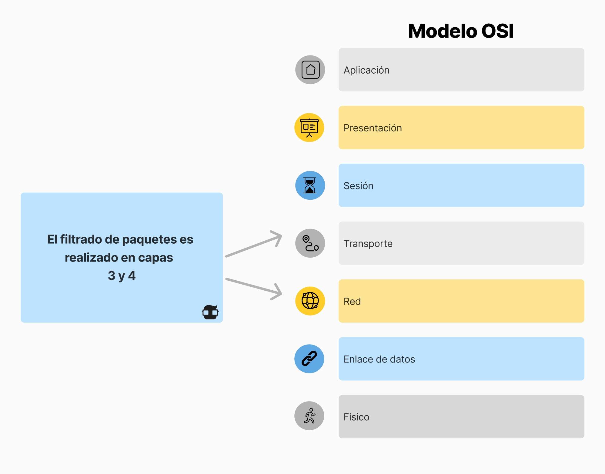

La seguridad en cada equipo individual sigue siendo esencial, pero no se puede considerar de forma aislada debido a:

- **El número de equipos** en muchas organizaciones.
- **Entornos heterogéneos** con distintos sistemas operativos y versiones.
- **Usuarios con privilegios de administración** que pueden representar riesgos.

Un cortafuego o firewall es una herramienta crucial que protege una red de sistemas y dispositivos interconectados mediante el control del tráfico de red. Aunque ningún cortafuego actual cumple completamente con todos los requisitos de seguridad, todos intentan acercarse lo más posible a las siguientes características clave:

- Todo el tráfico de “dentro a fuera” y de “fuera a dentro” debe pasar por él.
- Solo el tráfico autorizado basado en la política de seguridad puede continuar.
- Debe ser completamente inatacable.

## Ventajas de los Firewalls

- **Aplicación Centralizada de Políticas de Seguridad**: Permiten definir y aplicar políticas de seguridad de manera centralizada.
- **Autenticación Avanzada**: Soportan técnicas de autenticación avanzadas de forma más eficaz y económica que si se hiciera equipo por equipo.
- **Centralización de Alarmas y Registros**: Pueden centralizar las alarmas y los registros de tráfico, facilitando la monitorización.
- **Menor Complejidad de Configuración**: Requieren menos configuración en comparación con un sistema de propósito general.
- **Mantenimiento Sencillo**: Necesitan pocos usuarios definidos para su configuración y mantenimiento.

## Desventajas de los Firewalls

- **Falsa Sensación de Seguridad**: Pueden inducir una falsa sensación de seguridad si no se complementan con otras medidas de seguridad.
- **Complejidad de Configuración**: Los firewalls más sofisticados pueden requerir configuraciones complejas.
- **Cuello de Botella**: Pueden representar un cuello de botella para el tráfico de red si no se dimensionan adecuadamente.

## Tipos de Firewalls

### 1. **Filtros de Paquetes**

- **Funcionamiento**: Operan en los niveles de red y transporte, filtrando paquetes IP basados en valores de algunos campos de las cabeceras de IP, TCP o UDP.
- **Ventajas**:
  - Simplicidad y bajo costo.
  - Impacto mínimo en el rendimiento de la red.
- **Desventajas**:
  - Limitación en la inspección del contenido de los paquetes.
  - Vulnerabilidad a ataques de suplantación de IP.

#### Ejemplo: `iptables` para Linux

### 2. **Stateful Inspection (Inspección con Estado)**

- **Funcionamiento**: Mantienen una tabla de estado para rastrear el estado de las conexiones activas y tomar decisiones basadas en el estado de la conexión.
- **Ventajas**:
  - Mayor seguridad que el filtrado de paquetes básico al rastrear conexiones.
  - Mejor control del tráfico con conciencia del contexto.
- **Desventajas**:
  - Mayor uso de recursos.
  - Configuración más compleja.

#### Ejemplo: `Checkpoint Firewall-1`, `Cisco ASA`

### 3. **Firewalls de Capa de Aplicación (Proxy Firewalls)**

- **Funcionamiento**: Operan en la capa de aplicación e inspeccionan el contenido de los paquetes para aplicar políticas de seguridad específicas de aplicaciones.
- **Ventajas**:
  - Inspección profunda de los datos de la aplicación.
  - Capacidad de filtrar contenido y comandos específicos.
- **Desventajas**:
  - Pueden introducir latencia.
  - Requieren más recursos para gestionar.

#### Ejemplo: Servidores Proxy como `Squid`

### 4. **Firewalls de Próxima Generación (NGFW)**

- **Funcionamiento**: Integran la tecnología de firewall tradicional con características adicionales como prevención de intrusiones, inspección profunda de paquetes y conciencia de aplicaciones.
- **Ventajas**:
  - Protección integral contra amenazas.
  - Control y visibilidad de aplicaciones.
- **Desventajas**:
  - Mayor costo.
  - Configuración y gestión más complejas.

#### Ejemplo: `Palo Alto Networks`, `Fortinet FortiGate`

## Arquitecturas de Firewalls

### 1. **Arquitectura de un Solo Firewall**

- **Descripción**: Adecuada para redes pequeñas con un solo punto de control.
- **Ventajas**: Simplicidad y menor costo.
- **Desventajas**: Punto único de fallo.

### 2. **Arquitectura de Host con Dos Interfaces (Dual-Homed Host)**

- **Descripción**: Un firewall con dos interfaces de red, una conectada a la red interna y otra a la externa.
- **Ventajas**: Ofrece un nivel básico de aislamiento entre redes.
- **Desventajas**: Limitada escalabilidad.

### 3. **Arquitectura de Subred Filtrada (DMZ)**

- **Descripción**: Utiliza múltiples firewalls para crear una zona desmilitarizada (DMZ).
- **Ventajas**: Mayor seguridad con múltiples capas de protección.
- **Desventajas**: Mayor complejidad y costo.

### 4. **Arquitectura de Firewall Distribuido**

- **Descripción**: Emplea múltiples firewalls a lo largo de la red.
- **Ventajas**: Control granular sobre segmentos de red.
- **Desventajas**: Complejidad en la gestión.

## Consideraciones Adicionales

### Políticas de Firewall y Mejores Prácticas

- **Definición de Políticas**: Desarrollar políticas de firewall efectivas que equilibren seguridad y usabilidad.
- **Actualización y Revisión**: Importancia de actualizar y revisar regularmente las reglas del firewall para adaptarse a nuevas amenazas.

### Escenarios del Mundo Real y Estudios de Caso

- **Ejemplo de Ataques Reales**: Discusión de ataques reales que podrían haberse mitigado o prevenido con configuraciones adecuadas de firewall.
- **Incidentes Notables**: El gusano SQL Slammer, que explotó vulnerabilidades en configuraciones de firewall.

### Limitaciones de los Firewalls y Medidas de Seguridad Complementarias

- **No son una Solución Independiente**: Los firewalls deben ser parte de una estrategia de seguridad más amplia.
- **Medidas Complementarias**: Incluir sistemas de detección de intrusiones (IDS), sistemas de prevención de intrusiones (IPS) y soluciones de seguridad de punto final.

### Tendencias Emergentes

- **Firewalls en la Nube**: Mención de firewalls basados en la nube que son cada vez más relevantes en entornos basados en la nube.
- **Firewalls Virtuales**: Consideración de firewalls virtuales que ofrecen flexibilidad en entornos virtualizados.

## Conclusión

En resumen, los firewalls son una pieza fundamental en la seguridad de redes, proporcionando un control de tráfico crítico para proteger los activos digitales de las organizaciones. Sin embargo, deben ser parte de una estrategia de seguridad integral que incluya múltiples capas de defensa. Los estudiantes deben continuar explorando temas avanzados y configuraciones para profundizar su conocimiento y experiencia.
