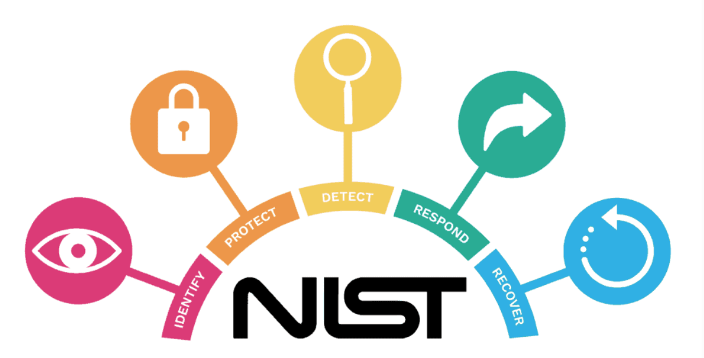

# Lectura 1 📕:  Qué es NIST y su importancia en la ciberseguridad

## ¿Qué es NIST?

Cuando hablamos de NIST nos referimos al **Instituto Nacional de Estándares** y **Tecnología** de Estados Unidos, esta agencia se encarga de desarrollar y promover estándares de mediciones, tecnología y seguridad además de realizar investigaciones en diversas áreas tanto científicas como tecnológicas.

Los estándares tecnológicos implica el desarrollo de estándares de cómo actuar cuando tenemos problemas de inoperabilidad de sistemas, seguridad informática, criptografía, computación en la nube y muchas otras áreas de la tecnología, por lo que estos estándares son importantes ya que garantiza la compatibilidad y la seguridad de los sistemas y redes, y así fomentar la innovación y adopción de nuevas tecnologías.

Como analista de ciberseguridad es muy importante que conozcas la NIST ya que muchos de los estándares desarrollados por esta agencia son utilizados en la actualidad, el más conocido es el marco de Ciberseguridad de NIST también conocido como el NIST framework ya que nos sirve de guía para que las organizaciones puedan evaluar y mejorar su postura de ciberseguridad al identificar y gestionar los riesgos y así establecer medidas de protección adecuadas a la organización.

Otra contribución que podemos explicar para realzar la importancia del NIST en la ciberseguridad es la labor de investigaciones para así comprender mejor amenazas y vulnerabilidades cibernéticas, así como para desarrollar nuevas tecnologías y enfoques de seguridad, esto ayuda a impulsar la innovación y desarrollar soluciones más efectivas para proteger los sistemas y las redes.

## Introducción al marco de ciberseguridad de NIST

El marco de ciberseguridad de NIST también conocido como el NIST framework es una guía integral desarrollada para ayudar a las organizaciones a evaluar y gestionar su postura de ciberseguridad. Este marco se ha convertido en una referencia muy popular dentro del área de tecnología, proporcionando un enfoque estructurado y basado en las mejores prácticas para abordar un problema o desafío de la seguridad de información de una organización.

Podemos decir que uno de los propósitos principales del NIST framework es entender que cada empresa debe ser sistemáticamente resiliente para enfrentar todas las debilidades y vulnerabilidades de seguridad que pueda haber y así minimizar la magnitud de una ciberamenaza, por lo que el NIST framework proporciona procedimientos que pueden ser desarrollados para dar protección sobre dichas ciberamenazas.

Otro propósito de este marco son las obligaciones legales y morales para proporcionar la integridad, seguridad y privacidad de todos los usuarios, por lo que es importante tomar medidas para proteger la infraestructura crítica de la organización

Una de las fortalezas del Marco de Ciberseguridad del NIST es su flexibilidad y adaptabilidad. No es un conjunto de reglas rígidas, sino una guía que permite a las organizaciones adaptar sus enfoques de ciberseguridad a sus necesidades y riesgos específicos. El marco también se actualiza regularmente para reflejar las últimas amenazas y desafíos en el ámbito de la ciberseguridad, asegurando su relevancia continua en un entorno en constante evolución.

### Objetivos y beneficios de la implementación del Marco de ciberseguridad de NIST

El objetivo principal del Marco de Ciberseguridad del NIST es ayudar a las organizaciones a comprender y gestionar los riesgos cibernéticos de manera efectiva. 

El marco se basa en cinco funciones principales: 

✅ Identificar.

✅ Proteger.

✅ Detectar.

✅ Responder.

✅ Recuperar. 

Estas funciones se aplican a través de una serie de categorías y subcategorías que abordan aspectos específicos de la ciberseguridad, como la gestión de riesgos, la protección de datos, la detección de amenazas y la respuesta a incidentes.

Otro objetivo es mejorar la postura de la ciberseguridad al proporcionar una guía para mejorar la postura de ciberseguridad de una organización. Ayuda a identificar las áreas de mejora y establecer metas y objetivos de seguridad claros. Al implementar las medidas y controles recomendados por el marco, las organizaciones pueden fortalecer su capacidad para prevenir, detectar y responder a las amenazas cibernéticas.

La implementación del marco fomenta una cultura de ciberseguridad en toda la organización. Promueve la conciencia y la responsabilidad de todos los miembros del equipo en la protección de los activos de información y la adopción de buenas prácticas de seguridad. Esto ayuda a crear un entorno en el que la seguridad cibernética sea una prioridad y esté integrada en todas las actividades y procesos.

Legalmente, el marco del NIST puede ayudar a las organizaciones a cumplir con los requisitos normativos y regulatorios en materia de ciberseguridad. Al seguir las pautas y mejores prácticas establecidas en el marco, las organizaciones pueden demostrar su compromiso con la seguridad de la información y cumplir con los estándares y regulaciones aplicables.

Al tener claro toda esta información introductoria sobre NIST y su marco de ciberseguridad, podemos comprender su importancia en esta área al tener como un objetivo principal evaluar y gestionar los riesgos cibernéticos que podamos enfrentarnos en una organización y así establecer una cultura de seguridad y cumplir con requisitos normativos. Seguir las prácticas de este marco nos ayudará a fortalecer la capacidad de proteger los activos de información de la empresa y responder de manera efectiva a las ciberamenazas.