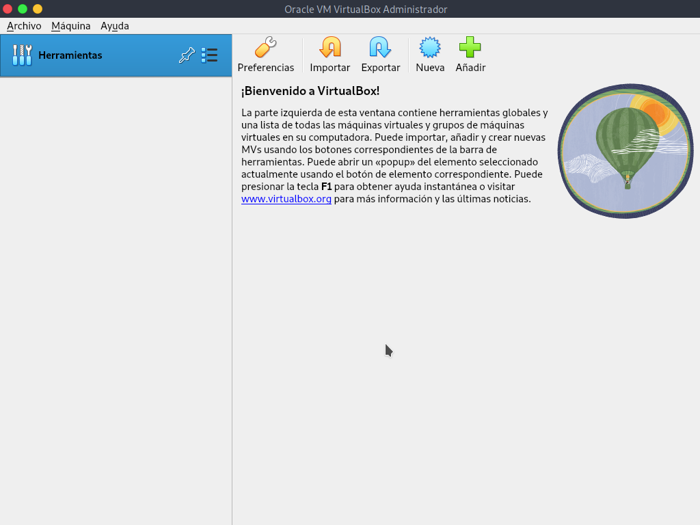
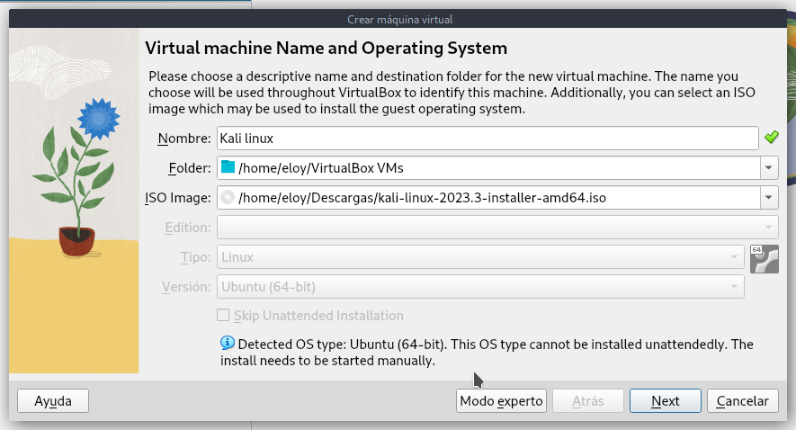
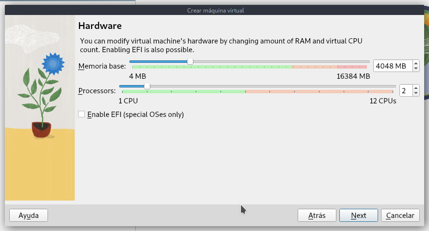
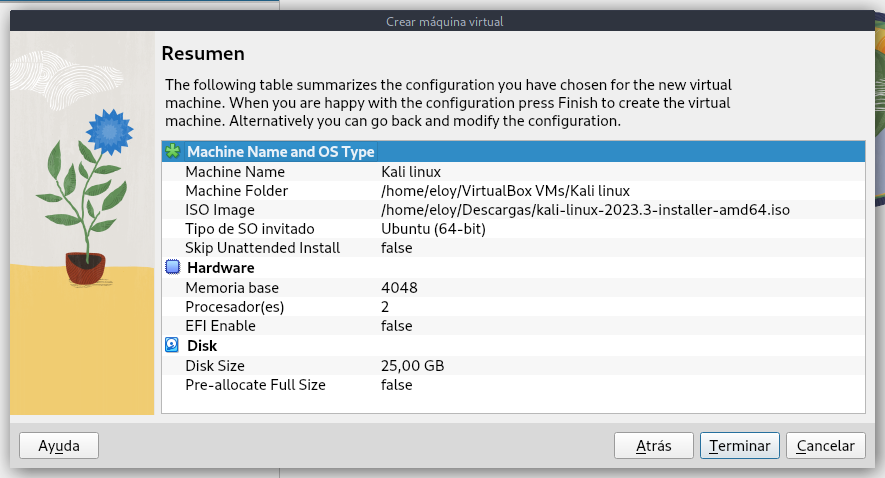

# 💡 Laboratorio: Instalacion y configuracion de sistema operativo

**Para este laboratorio instalaremos Kali Linux en una máquina virtual de VirtualBox**

1. Abrimos la interfaz de virtualBox y seleccionamos a la opción nueva

2. Llenamos la información de la máquina virtual donde 
- Nombre: El nombre que llevaría nuestra máquina virtual (generalmente sería el nombre del sistema operativo que usaremos).
- Folder: La Carpeta en donde se almacenará la máquina virtual.
- Iso Image: El archivo iso para instalar nuestra máquina virtual.

3. Colocamos la cantidad de memoria y procesadores que le queremos asignar a la máquina virtual, en este caso asignamos dos procesadores y 4 gb de ram

4. Asignamos la cantidad de memoria virtual que le queramos dar a la máquina virtual

5. Revisamos el resumen y vemos que todo está como lo necesitamos

