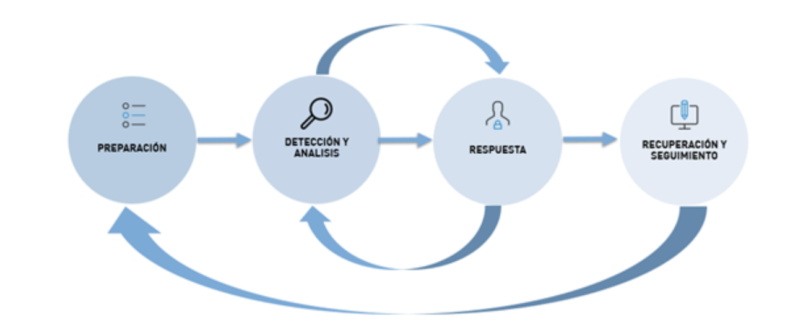

# Lectura 6 📕: Gestión de incidentes de seguridad y DLP

## Detección y respuesta ante incidentes de pérdida de datos

La detección y respuesta ante incidentes de pérdida de datos es un aspecto fundamental en la seguridad de la información. En un mundo cada vez más digitalizado, donde la información se encuentra en constante riesgo, es esencial contar con estrategias efectivas para proteger los datos sensibles y actuar rápidamente en caso de una brecha de seguridad.

La detección de incidentes de pérdida de datos implica la implementación de sistemas y herramientas de monitoreo que permitan identificar cualquier actividad sospechosa o anormal en los sistemas de información. Estos sistemas pueden incluir firewalls, sistemas de detección de intrusos , análisis de registros y monitoreo de red, entre otros. La idea es detectar cualquier intento de acceso no autorizado, robo de información o cualquier otra actividad que pueda poner en riesgo la integridad de los datos.

Una vez que se detecta un incidente de pérdida de datos, es crucial contar con un plan de respuesta efectivo. Esto implica tener un equipo de respuesta a incidentes capacitado y preparado para actuar de manera rápida y eficiente. El equipo debe contar con roles y responsabilidades claramente definidos, así como con los recursos necesarios para investigar y contener el incidente.

La respuesta ante un incidente de pérdida de datos debe incluir las siguientes etapas:

- **Evaluación inicial**: Se debe determinar la naturaleza y el alcance del incidente, identificando qué datos se vieron comprometidos y cuál fue el vector de ataque utilizado.
- **Contención**: Una vez que se ha evaluado el incidente, es importante tomar medidas para contenerlo y evitar que se propague. Esto puede incluir el aislamiento de sistemas afectados, la desactivación de cuentas comprometidas o la implementación de parches de seguridad.
- **Investigación**: Se debe llevar a cabo una investigación exhaustiva para determinar las causas y el impacto del incidente. Esto puede implicar el análisis de registros, entrevistas con personal involucrado y la colaboración con expertos en seguridad.
- **Notificación**: En muchos casos, es necesario notificar a las partes afectadas por la pérdida de datos, como clientes, empleados o socios comerciales. Esta notificación debe realizarse de manera oportuna y transparente, proporcionando información clara sobre el incidente y las medidas tomadas para mitigar sus efectos.
- **Recuperación y mejora**: Una vez que se ha contenido el incidente y se ha notificado a las partes afectadas, es importante llevar a cabo acciones para recuperar los datos perdidos y mejorar la seguridad de los sistemas. Esto puede incluir la restauración de copias de seguridad, la implementación de medidas adicionales de seguridad y la revisión de políticas y procedimientos existentes.

## Procesos y procedimientos para la gestión de incidentes de seguridad

Los incidentes de seguridad pueden variar desde ataques cibernéticos hasta pérdida de datos o violaciones de la privacidad. Para abordar estos incidentes de manera efectiva, es fundamental contar con procesos y procedimientos bien definidos. Estos procesos y procedimientos ayudan a garantizar una respuesta rápida, coordinada y eficiente ante cualquier incidente de seguridad.

A continuación, se describen los principales procesos y procedimientos para la gestión de incidentes de seguridad:

- **Preparación**: La preparación es clave para una gestión efectiva de incidentes de seguridad. En esta etapa, se deben establecer políticas y procedimientos claros, así como identificar y capacitar a un equipo de respuesta a incidentes. Además, se deben implementar medidas de seguridad proactivas, como firewalls, sistemas de detección de intrusiones y sistemas de monitoreo de red, para detectar y prevenir incidentes.
- **Detección y notificación**: La detección temprana de un incidente de seguridad es fundamental para minimizar su impacto. Esto implica la implementación de sistemas de detección y monitoreo que alerten sobre actividades sospechosas o anormales. Una vez que se detecta un incidente, se debe notificar de inmediato al equipo de respuesta a incidentes para que pueda iniciar la investigación y la respuesta correspondiente.
- **Evaluación y clasificación**: Una vez que se ha notificado un incidente, se debe llevar a cabo una evaluación inicial para determinar la naturaleza y el alcance del incidente. Esto implica recopilar información relevante, como registros de actividad, registros de seguridad y cualquier otra evidencia disponible. Además, se debe clasificar el incidente según su gravedad y prioridad, lo que ayudará a asignar los recursos adecuados para su resolución.
- **Respuesta y mitigación**: En esta etapa, el equipo de respuesta a incidentes debe tomar medidas para contener y mitigar el incidente. Esto puede incluir el aislamiento de sistemas afectados, la desactivación de cuentas comprometidas, la aplicación de parches de seguridad y la restauración de copias de seguridad. El objetivo es minimizar el impacto del incidente y restaurar la normalidad lo antes posible.
- **Investigación y análisis**: Una vez que se ha contenido el incidente, se debe llevar a cabo una investigación exhaustiva para determinar las causas y el alcance del incidente. Esto implica analizar la evidencia recopilada, identificar las vulnerabilidades explotadas y determinar las lecciones aprendidas. Esta información es crucial para fortalecer las medidas de seguridad y prevenir futuros incidentes.
- **Informe y seguimiento**: Es importante documentar todos los aspectos del incidente, incluyendo las acciones tomadas, los resultados de la investigación y las recomendaciones para mejorar la seguridad. Además, se debe realizar un seguimiento para garantizar que las medidas correctivas se implementen de manera efectiva y se realicen las mejoras necesarias en los procesos y procedimientos existentes.

## **Investigacion y analisis de incidentes de pérdida de datos**

La investigación y análisis de incidentes de pérdida de datos es una parte crucial de la gestión de la seguridad de la información. Cuando ocurre una brecha de seguridad y se produce la pérdida de datos sensibles, es fundamental llevar a cabo una investigación exhaustiva para determinar las causas y el alcance del incidente. Esto permite comprender cómo ocurrió la brecha y qué medidas se deben tomar para prevenir incidentes similares en el futuro.

A continuación, describimos los principales aspectos para la investigación y análisis de incidentes de pérdida de datos:

- **Recopilación de información**: El primer paso en la investigación de un incidente de pérdida de datos es recopilar toda la información relevante. Esto incluye registros de actividad, registros de seguridad, informes de incidentes, entrevistas con el personal involucrado y cualquier otra evidencia disponible. Cuanta más información se recopile, más completa será la imagen del incidente.
- **Análisis forense**: El análisis forense desempeña un papel fundamental en la investigación de incidentes de pérdida de datos. Los expertos forenses examinan los sistemas y dispositivos afectados para identificar cómo se produjo la brecha y qué datos se vieron comprometidos. Utilizan técnicas especializadas para recuperar y analizar datos, como el análisis de registros, la recuperación de archivos eliminados y la identificación de huellas digitales.
- **Determinación de la causa raíz**: Una vez que se ha recopilado la información y se ha realizado el análisis forense, es importante determinar la causa raíz del incidente. Esto implica identificar las vulnerabilidades o debilidades en los sistemas de seguridad que permitieron que ocurriera la brecha. Puede ser el resultado de una configuración incorrecta, una falta de parches de seguridad, una contraseña débil o un ataque en línea. Al comprender la causa raíz, se pueden tomar medidas para fortalecer la seguridad y prevenir futuras brechas.
- **Evaluación del impacto**: Es esencial evaluar el impacto del incidente de pérdida de datos. Esto implica determinar qué datos se vieron comprometidos, qué información confidencial se expuso y qué consecuencias puede tener para las partes afectadas. Además, se debe evaluar el impacto financiero y reputacional para la organización. Esta evaluación ayuda a comprender la gravedad del incidente y a tomar las medidas adecuadas para mitigar sus efectos.
- **Informe y recomendaciones**: Una vez que se ha completado la investigación y el análisis, es importante documentar los hallazgos en un informe detallado. Este informe debe incluir una descripción del incidente, los resultados del análisis forense, la causa raíz identificada, el impacto del incidente y las recomendaciones para mejorar la seguridad. Estas recomendaciones pueden incluir la implementación de medidas adicionales de seguridad, la actualización de políticas y procedimientos, y la capacitación del personal.

> 📖 En resumen, la investigación y análisis de incidentes de pérdida de datos son fundamentales para comprender cómo ocurrió una brecha de seguridad y qué medidas se deben tomar para prevenir incidentes similares en el futuro. Al recopilar información, realizar análisis forenses, determinar la causa raíz, evaluar el impacto y documentar los hallazgos, las organizaciones pueden fortalecer su seguridad y proteger la información confidencial de manera más efectiva.

# ⚡**Quiz: Gestión de incidentes de seguridad y DLP

1. ¿En qué situación usted considera que exista una amenaza sobre la información de la organización?
2. Existe un marco de trabajo llamado nist framework el cual consta de medidas para ayudar a reducir los riesgos y tener una mejor administración de la información.
3. ¿En qué consta este marco y cómo se puede aplicar a la DLP?

**Descripción del Escenario**

Eres analista de ciberseguridad en la empresa “KAPECI.INC” donde tu labor es monitorear las actividades en la red y tomar acciones en caso de alguna amenaza a la información de la empresa

Un dia en el monitoreo de actividades observa una actividad inusual en la red del departamento de marketing donde están accediendo a documentos sensibles del departamento IT.

**Preguntas y desafíos**

1. **Evaluación inicial**

¿Cuál sería el primer paso que haría como analista de ciberseguridad?

¿Que determinar si este incidente es una equivocación (falso positivo) o una acción que puede escalar (verdadero positivo)

1. **Contención**

¿Qué acciones podemos tomar para contener el ataque?

1. **Investigación**

¿Qué podemos tomar en cuenta para hacer una investigación exhaustiva del incidente?

¿Qué información o logro podemos obtener con esta investigación?

**Recuperación y mejora**

¿Como analista de ciberseguridad, cuáles serían sus recomendaciones para mejorar el sistema y evitar que este tipo de incidentes se repita?

De haber datos perdidos ¿Se podría recuperar estos datos?