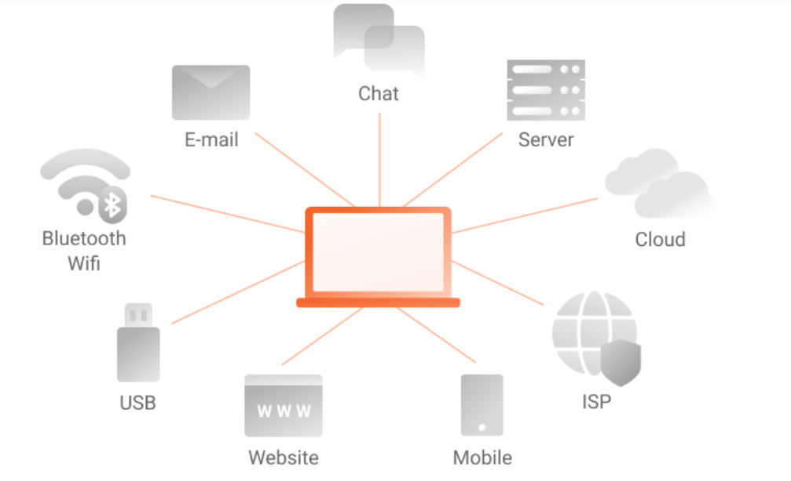

# Lectura 5 📕: Tecnología y herramientas de DLP

## Tipos de soluciones de DLP disponibles en el mercado

En el mercado actual, existen diferentes tipos de soluciones de DLP (Data Loss Prevention) disponibles para ayudar a las organizaciones a proteger su información confidencial y sensible. Estas soluciones se centran en prevenir la pérdida o filtración de datos críticos, ya sea intencional o accidentalmente. 

A continuación, se presentan algunos de los tipos más comunes de soluciones de DLP:

- **DLP de red**: Esta solución se enfoca en monitorear y controlar el flujo de datos a través de la red de una organización. Utiliza tecnologías como firewalls, sistemas de prevención de intrusos y gateways de seguridad para detectar y prevenir la transferencia no autorizada de datos confidenciales. También puede incluir la capacidad de encriptar datos en tránsito y aplicar políticas de seguridad específicas.
- **DLP de endpoint**: Esta solución se centra en proteger los dispositivos finales, como computadoras portátiles, computadoras de escritorio y dispositivos móviles. Utiliza agentes de software instalados en los dispositivos para monitorear y controlar el acceso y el uso de los datos confidenciales. Puede incluir funciones como el bloqueo de dispositivos de almacenamiento externo, la prevención de la impresión o copia de datos sensibles, y la detección de actividades sospechosas.
- **DLP en la nube**: Con el aumento de la adopción de servicios en la nube, las soluciones de DLP en la nube se han vuelto cada vez más importantes. Estas soluciones se integran con plataformas en la nube, como servicios de almacenamiento o colaboración, para monitorear y proteger los datos confidenciales que se almacenan o comparten en la nube. Pueden incluir funciones como la clasificación automática de datos, la prevención de la filtración de datos en la nube y la aplicación de políticas de seguridad específicas.
- **DLP de contenido**: Esta solución se enfoca en analizar y clasificar el contenido de los datos para identificar información confidencial y sensible. Utiliza técnicas de análisis de contenido, como el reconocimiento de patrones y la búsqueda de palabras clave, para identificar datos que deben ser protegidos. Puede incluir funciones como la clasificación automática de datos, la encriptación selectiva de contenido y la prevención de la filtración de datos a través de canales de comunicación.

> 💡 Recuerda que cada organización tiene necesidades y requisitos específicos, por lo que es importante evaluar cuidadosamente las soluciones de DLP disponibles en el mercado y seleccionar aquella que mejor se adapte a las necesidades de seguridad de la organización. Además, es recomendable contar con la asesoría de expertos en seguridad de la información para implementar y configurar adecuadamente la solución de DLP elegida.

## Funcionalidades de las soluciones de DLP: monitoreo, prevención

Las soluciones de DLP ofrecen una variedad de funcionalidades diseñadas para proteger la información confidencial y sensible de una organización. Estas funcionalidades se centran en el monitoreo, la prevención y la detección de la pérdida o filtración de datos críticos. A continuación, se describen estas funcionalidades en detalle:

- **Monitoreo**:

Una de las principales funcionalidades de las soluciones de DLP es el monitoreo continuo de los datos en la organización. Esto implica supervisar el flujo de datos tanto dentro como fuera de la red, así como en los dispositivos finales. El monitoreo se realiza mediante la implementación de agentes de software en los dispositivos y la configuración de políticas de seguridad específicas. El objetivo es identificar cualquier actividad sospechosa o no autorizada que pueda indicar una posible pérdida de datos.

- **Prevención**:

Otra funcionalidad clave de las soluciones de DLP es la prevención de la pérdida de datos. Esto implica establecer políticas y controles para evitar que los datos confidenciales salgan de la organización de manera no autorizada. Las soluciones de DLP pueden bloquear o restringir la transferencia de datos a través de diferentes canales, como correo electrónico, mensajería instantánea, dispositivos de almacenamiento externo o servicios en la nube. También pueden aplicar técnicas de encriptación para proteger los datos en tránsito o en reposo.

- **Detección**:

 La detección de la pérdida de datos es otra funcionalidad importante de las soluciones de DLP. Esto implica la capacidad de identificar patrones o comportamientos extraños que puedan indicar una posible filtración de datos. Las soluciones de DLP utilizan técnicas avanzadas de análisis de contenido y reconocimiento de patrones para identificar información confidencial, como números de tarjetas de crédito, números de seguridad social o información de salud. Dentro de los datos en tránsito o almacenados también pueden detectar intentos de evadir las políticas de seguridad establecidas.

## Integración de soluciones de DLP con la infraestructura existente

La integración de soluciones de DLP con la infraestructura existente es un paso crucial para garantizar una implementación efectiva y eficiente de la protección de datos confidenciales y sensibles. Al integrar una solución de DLP con la infraestructura existente, las organizaciones pueden aprovechar al máximo sus inversiones tecnológicas y garantizar una protección integral de los datos en todos los puntos de la red.

Existen varios aspectos a considerar al integrar una solución de DLP con la infraestructura existente:

| Evaluación de la infraestructura existente | Antes de integrar una solución de DLP, es importante realizar una evaluación exhaustiva de la infraestructura existente. Esto implica identificar los sistemas, aplicaciones y dispositivos que almacenan o transmiten datos confidenciales. También es importante comprender cómo se gestionan y protegen actualmente estos datos. |
| --- | --- |
| Compatibilidad y requisitos técnicos | Al seleccionar una solución de DLP, es esencial asegurarse de que sea compatible con la infraestructura existente. Esto implica verificar si la solución puede integrarse con los sistemas operativos, aplicaciones y dispositivos utilizados en la organización. Además, es importante considerar los requisitos técnicos, como los recursos de hardware y software necesarios para implementar y mantener la solución de DLP. |
| Configuración y personalización | Una vez seleccionada la solución de DLP, es necesario configurarla y personalizarla según las necesidades específicas de la organización. Esto implica definir las políticas de seguridad, establecer reglas de detección y prevención, y adaptar la solución a los flujos de trabajo existentes. Es importante asegurarse de que la solución de DLP se ajuste a los requisitos de seguridad y cumplimiento de la organización. |
| Integración con sistemas de gestión de seguridad | Para una protección integral de los datos, es recomendable integrar la solución de DLP con otros sistemas de gestión de seguridad, como firewalls, sistemas de detección de intrusiones y sistemas de gestión de eventos e información de seguridad (SIEM). Esto permite una visibilidad y respuesta más efectiva ante posibles amenazas y eventos de pérdida de datos. |
| Capacitación y concientización del personal | La integración exitosa de una solución de DLP también implica capacitar y concientizar al personal sobre su uso y funcionalidades. Es importante educar a los empleados sobre las políticas y procedimientos de DLP, así como proporcionar capacitación sobre cómo utilizar la solución de manera efectiva. Esto garantiza que todos los usuarios estén al tanto de las mejores prácticas de seguridad y puedan colaborar en la protección de los datos confidenciales. |