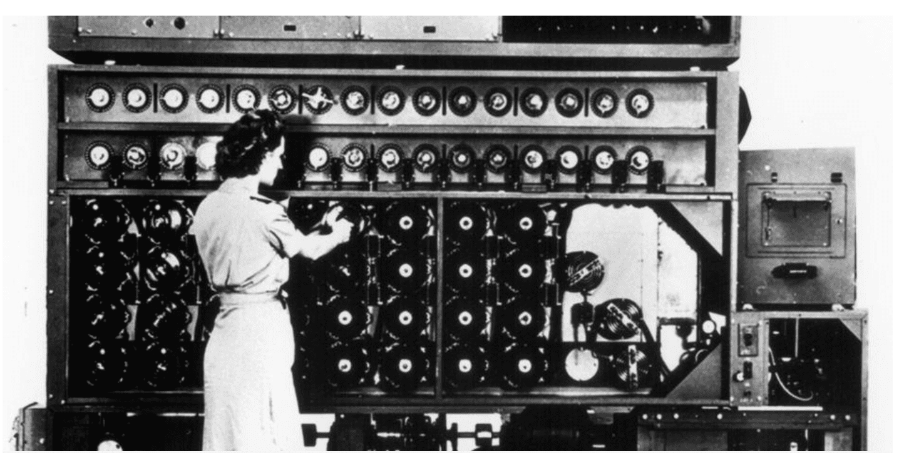

Cryptography in computing is the field that deals with developing techniques and methods for encrypting and decrypting information to ensure its confidentiality, integrity, and authenticity in the digital environment. Cryptography enables data to be transmitted and stored securely, even if intercepted by unauthorized individuals.

In simple terms, cryptography in computing uses mathematical algorithms to convert readable data into an unreadable format and then reconvert it to the original format when necessary. The original data is called "**plaintext**", and the encrypted data is referred to as "**ciphertext**." To carry out the process of encryption and decryption, keys are used, which are secret values employed by the algorithms.

There are two main types of cryptography used in computing:

1. **Symmetric Key Cryptography:** In this approach, a single key is used for both encrypting and decrypting data. Both the sender and receiver must know and keep this key secret. If a third party intercepts the key, they could decrypt the data. Common symmetric encryption algorithms include DES (Data Encryption Standard) and AES (Advanced Encryption Standard).
2. **Public Key Cryptography:** Also known as asymmetric cryptography, this approach uses a pair of keys: a public key and a private key. The public key is freely shared and used to encrypt data, while the private key, which must be kept secret, is used to decrypt it. Additionally, the private key is used to digitally sign documents to authenticate their origin. A popular algorithm in this field is RSA.

Cryptography in computing is essential for ensuring the privacy and security of online communications, electronic transactions, user authentication, and the protection of confidential data. Moreover, it plays a crucial role in the trust users have in the security of their daily digital interactions, such as online purchases, access to bank accounts, and the exchange of personal information.

### Types of Ciphers

There are various types of ciphers used in the field of cryptography to safeguard the confidentiality of information. These cipher types can be classified into two main categories: symmetric encryption and asymmetric encryption (or public-key encryption). Here's an explanation of both:

**1. Symmetric Encryption:**
In symmetric encryption, a single key is used for both encrypting and decrypting data. This means that both the sender and the receiver must know and keep the same key secret. The main advantage of symmetric encryption is that it is fast and efficient for both encryption and decryption. However, the challenge lies in the secure management of the shared key, as any exposure or compromise of the key can jeopardize data security.

Examples of symmetric encryption algorithms:

- **AES (Advanced Encryption Standard):** Widely used and considered secure for encrypting data.
- **DES (Data Encryption Standard):** A previously common algorithm, but now considered insecure due to its short key length.

**2. Asymmetric Encryption (Public Key Encryption):**
Asymmetric encryption uses a pair of keys: a **public key** and a **private key**. The public key is freely shared and used to encrypt data before sending it. However, only the private key corresponding to the recipient can decrypt the data. This solves the issue of managing shared keys in symmetric encryption. Additionally, private keys are also used to digitally sign documents to authenticate their origin.

Examples of asymmetric encryption algorithms:

- **RSA (Rivest-Shamir-Adleman):** Widely used for encryption and digital signatures in security applications.
- **ECC (Elliptic Curve Cryptography):** A public-key encryption algorithm that offers security comparable to RSA but with shorter keys, making it resource-efficient.

In general, both symmetric and asymmetric encryption play important roles in safeguarding information online and in the security of digital communications. They are often used in combination to leverage the advantages of both approaches and ensure enhanced security in various contexts and applications.

Cryptography is utilized in a wide range of applications to protect the confidentiality, integrity, and authenticity of information in the digital world. Here are some of the most common uses of cryptography:

|  **Secure Communications** | Cryptography is used to encrypt online communications such as emails, text messages, and phone calls. This ensures that only the authorized recipient can access and comprehend the content of the message. |
| --- | --- |
| **Financial Transactions** | Cryptography is employed in online transactions and banking operations to protect financial information, such as credit card numbers and passwords. This prevents data theft and fraud. |
| **User Authentication** | In authentication, cryptography is used to generate and verify digital signatures, passwords, and digital certificates. It helps confirm that users are who they claim to be before allowing them access to sensitive systems and data. |
| **Secure Data Storage**  | Information stored on devices, such as hard drives and USB drives, can be encrypted to protect it in case of loss or theft. Even if a device is lost, the data remains inaccessible without the proper key. |
| **Secure Web Browsing** | Cryptography is used to enable secure connections through the HTTPS protocol on websites. This ensures that data transmitted between the user's browser and the web server is encrypted and protected. |
| **Privacy Protection** | In applications dealing with personal data, cryptography helps protect users' privacy. This includes messaging apps, social networks, and cloud storage services. |
| **Digital Signatures** | Cryptography enables the creation of digital signatures for documents and electronic transactions. This ensures the authenticity and integrity of documents, as any modification would be detectable. |
| **Network and System Security** | Cryptography is used in Virtual Private Networks (VPNs) to create secure channels between devices and encrypt traffic. It is also employed to protect stored passwords in systems and to verify the integrity of downloaded files. |
| **Intellectual Property Protection** | Content creators can use cryptography to protect their digital creations, such as music, movies, and e-books, and prevent piracy. |
| **Internet of Things (IoT)** | Cryptography ensures secure communication between connected devices in the IoT, protecting data and preventing unauthorized manipulation of devices. |

In summary, cryptography is essential for safeguarding security and privacy in the digital world. Through a variety of applications and uses, cryptography plays a crucial role in protecting sensitive information and establishing trust in online communications and transactions.

Centuries ago, during Ancient Greece and Rome, cryptography was already in use to protect secret messages in times of war and diplomacy. One of the most well-known methods is the "Caesar Cipher," used by Julius Caesar to conceal military messages. In this method, each letter of the message was replaced by another that was a fixed number of positions forward in the alphabet.

However, one of the highlights in the history of cryptography occurred during World War II. The Germans used an encryption machine called "Enigma" to encode their military communications, believing them to be indecipherable. But a team of mathematicians and cryptographers led by Alan Turing at Bletchley Park, UK, managed to decipher the Enigma, a crucial achievement that helped the Allies gather key information and alter the course of the war.

After the war, cryptography continued to evolve with the advent of computing. Public-key cryptography, developed in the 1970s by Whitfield Diffie and Martin Hellman, allowed the secure exchange of keys without the need for sharing prior secrets. This paved the way for online security, including secure internet browsing and electronic transactions.

In modern times, cryptography is essential for online security, protecting confidential data, and facilitating secure authentication. From encrypting messages to securing passwords and digital signatures, cryptography remains a crucial tool in safeguarding privacy and security in the digital world.
