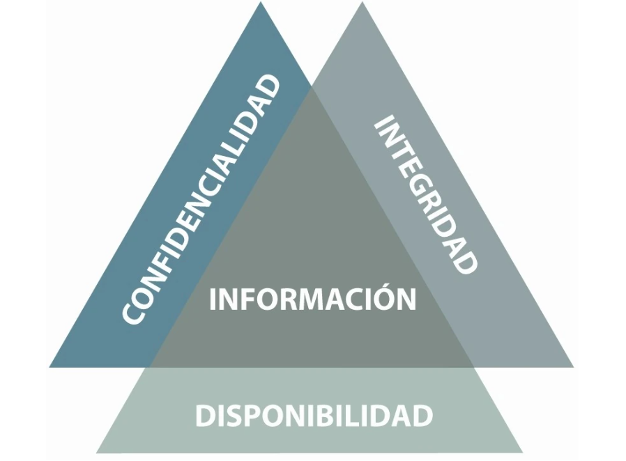

# Lectura 5📕: Fundamentos de la seguridad de la información

## Security Triad

Nowadays, information is everywhere, and this information may be at risk of being intercepted or altered by someone else. There are principles designed to protect our data and information, and one of the main ones is the Security Triad.

Also known as **CIA** (Confidentiality, Integrity, Availability) by its English acronym, it forms the basis of any effective cybersecurity strategy.

The foundation of the security triad is that all information must be confidential, intact, and available when required.

Delving into these concepts, it is possible to better understand the implications and methods involved in their implementation. Let's take a closer look at each:

- **Confidentiality**

Confidentiality refers to protecting information against unauthorized access. The goal is to ensure that only authorized individuals have access to confidential information.

Some examples of measures ensuring confidentiality include:

| Data Encryption | Use encryption algorithms to protect sensitive data so that it can only be read by individuals with the appropriate decryption key. |
| --- | --- |
| Access Control | Implement mechanisms like passwords, two-factor authentication, and access control lists to limit who can access confidential information. |
| Security Policies | Establish clear policies and procedures on how confidential information should be handled and shared within an organization. |

- **Integrity**

Integrity refers to protecting the accuracy and completeness of information. It involves ensuring that data is not altered in an unauthorized manner, guaranteeing its accuracy and reliability.

Some examples of measures ensuring integrity include:

| Digital Signatures | Use digital signatures to verify the integrity of data and ensure that it has not been modified during transit or storage. |
| --- | --- |
| Audit Logs | Maintain detailed audit logs that track changes and activities related to information, facilitating the detection of unauthorized alterations. |
| Backups | Perform regular backups of information to ensure that, in case of damage or alteration, a valid and reliable version can be restored. |

- **Availability**

Availability refers to ensuring that information is available and accessible when needed. This involves ensuring that systems and data are available and functioning correctly for authorized users.

Some examples of measures ensuring availability include:

| Business Continuity Plans | Develop plans and procedures to ensure the availability of systems and information in case of disruptions, such as natural disasters or system failures. |
| --- | --- |
| Redundancy and Backup | Establish redundant systems and perform backups to ensure data availability in case of failures or losses. |
| Maintenance and Updates | Regularly perform system maintenance and ensure that security patches and updates are up-to-date to prevent interruptions due to known vulnerabilities. |
| Network Monitoring | Regular network monitoring can help identify and address issues before they impact data availability. |

## Threats

Threats are anything that poses a risk to the security of people's information. Users are exposed to threats when they browse the internet, use services, make purchases, or engage in other activities online.

### Malware

Malware is any type of software created to cause harm or compromise the security of other **software** or **hardware**. Malware, short for "malicious software," is a collective term used to describe viruses, ransomware, spyware, trojans, and any other type of code or software created with malicious intent.

The concept of malware revolves around malicious intent. The significance of malware lies in the damage it can inflict on a computer, a computer system, a server, or a network. It is the how and why that differentiate one type of malware from the next.

The world of malware is diverse, but many types of malware share similar warning signs. Some symptoms of a malware infection on a device include:

1. **Sudden decreases in performance**: Malware can consume a significant amount of the device's processing power, leading to severe slowdowns.
2. **Frequent system crashes and shutdowns**: Some types of malware will cause system shutdowns or computer crashes, while others may trigger locks by consuming too much RAM or raising CPU temperature. High and sustained CPU usage can be a sign of malware.
3. **Deleted or damaged files**: Malware often deletes or damages files as part of its plan to cause as much chaos as possible.
4. **A large number of pop-up ads**: The role of adware is to flood you with spam through pop-up windows. Other types of malware can also cause pop-up ads and alerts.
5. **Unknown applications**: Malware can install additional applications on the device. If you see new programs that you didn't install, it could be the result of a malware attack.

Certain strains of malware are easier to detect than others. **Ransomware** and **adware** are typically immediately visible, while **spyware** remains hidden. The only secure way to detect all malware before it infects your device is with a specific antivirus tool.

## Social Engineering

Social engineering is the illegitimate practice of obtaining confidential information through the manipulation of legitimate users. It is a set of techniques that certain individuals can use to obtain information, access, or permissions in information systems that allow them to cause harm to the compromised person or organization. It is used in various forms of scams and identity theft. The principle that underlies social engineering is that, in any system, users are the weak link.

In practice, a social engineer will commonly use the phone or the internet to deceive people, pretending to be, for example, a bank employee, another company employee, a technician, or a customer. Via internet, the sending of fake requests for access permission renewals to web pages or fake emails requesting responses is also used. Even the famous chains, leading individuals to reveal their login credentials or sensitive, confidential, or critical information.

### Phishing Attacks

Phishing attacks can be classified according to the target against which the attack is directed, the purpose, the medium used, or according to the mode of operation. A specific case may belong to several types at once. Currently, more than 10,000 forms of phishing have been identified. The most common types of phishing attacks are:

- **General Phishing**: Traditional phishing, Bulk Phishing, or Spray and pray. It consists of the mass sending of emails to users. These emails impersonate trusted entities (e.g., banks) and aim to deceive the user and obtain information. For example, the message includes links to malicious domains. To disguise these links, it is common for the text of the link to be the correct URL, but the link itself points to the malicious site.
- **Vishing:** Similar to traditional phishing, but deception occurs through a phone call. The term is derived from the combination of two English words: 'voice' and 'phishing.' A typical example of using this technique is when a cybercriminal has already stolen confidential information through a phishing attack but needs the SMS code or digital token to perform and validate a transaction. At that moment, the cybercriminal calls the client, identifying themselves as bank personnel and, with particularly alarming messages, tries to get the client to reveal the number of their SMS code or digital token, which is necessary to authorize the transaction.
- **Qrishing:** Phishing through QR codes, which involves manipulating QR codes and subsequently deceiving victims by impersonating the website or application accessed by scanning the code, directing the user to a fraudulent link used to obtain private information from victims.
- **Smishing:** Similar to traditional phishing, but deception occurs through text messages, whether SMS or instant messaging (like WhatsApp). A typical example of this technique is when the client receives a text message, where the sender pretends to be the bank, and informs them that a suspicious purchase has been made with their credit card. The text also requests the client to contact the bank by phone and provides a fake number. The client returns the call, and it is then that the cybercriminal, posing as the bank, requests confidential information to supposedly cancel the purchase. In a variant of this modality, the message could also include a link to a fraudulent website to request sensitive information.

### Brute Force Attacks

A brute force attack is a trial-and-error method used to decode confidential data. The most common applications for brute force attacks are decrypting passwords and breaking encryption keys (keep reading for more information on encryption keys). Other common targets for brute force attacks are API keys and SSH logins. Brute force password attacks are often carried out using scripts or bots targeting a website's login page.

What distinguishes brute force attacks from other decoding methods is that brute force attacks do not employ an intellectual strategy; they simply attempt to use different combinations of characters until the correct combination is found. This is akin to a thief trying to open a combination safe by trying all possible combinations of numbers until the safe opens.

Common types of brute force attacks include:

- **Simple Brute Force Attacks:** In this form of attack, combinations of standard passwords or personal identification numbers are used. Simple attacks often succeed because many users do not use a password manager and continue to use easily guessable passwords with common words.
- **Dictionary Attacks:** Attackers start with an individual username and try possible passwords extracted from dictionaries but modify the words with special characters and numbers.
- **Hybrid Brute Force Attacks:** In this case, external logic is used to determine password variations and possible combinations that are more likely to achieve the intended goal, and then all possible variations are tested.

## Password and Authentication Security

### Strong Passwords

Also known as a password, a password is a word, phrase, or signal known only to certain individuals, allowing them to recognize each other or access a previously inaccessible site. Nowadays, a password serves as an authentication method to access a controlled resource, site, or group.

A strong password is a word or phrase characterized by its difficulty to guess or decipher by any automated program. It can include numbers, uppercase letters, special characters, or even better, be an **alphanumeric** password.

Passwords that are most challenging for hackers and cybercriminals to defeat are those with more than twelve characters, including numbers, letters, and symbols, and have no relation to the user's personal data.

## Authentication

### Authentication and Authorization

Authentication is the process a user must follow to access the resources of a system or a computer network. This process involves identification (telling the system who the user is) and authentication (proving that the user is who they claim to be). Authentication alone does not verify the user's access rights; these are confirmed in the authorization process.

In general, the security of data networks requires three processes to grant access to network services: **authentication**, **authorization**, and **accounting**.

1. **Authentication:** The process by which the user is uniquely identified; that is, without a doubt or mistake, proving they are who they say they are.
2. **Authorization:** The process by which the data network authorizes the identified user to access certain resources.
3. **Accounting:** The process by which the network records each and every access to resources made by the user, whether authorized or not.

These three processes are known by the acronym AAA: Authentication, Authorization, and Accounting.

**Types of Authentication**

Authentication can be carried out using one or more of the following methods:

- Knowledge-based Authentication - based on information known only to the user.
- Possession-based Authentication - based on something the user possesses.
- Characteristics-based Authentication - based on a physical characteristic of the user.

Authorization is a part of the operating system that protects system resources by allowing them to be used only by those consumers who have been granted authorization to do so. Resources include files and other data objects, programs, devices, and functionalities provided by applications. Examples of consumers are system users, programs, and other devices.

The authorization process is used to decide whether the person, program, or device "X" has permission to access the data, functionality, or service.

## Two-Factor Authentication

**Two-Factor** Authentication is a tool provided by various online service providers that adds an additional layer of security to the login process of your internet accounts. The mechanics are simple: when a user logs into their personal account on an online service, this tool requests them to confirm the ownership of their account by providing two distinct factors. The first of these is the password. The second can be various things, depending on the service. In the most common cases, it is often a code sent to a mobile phone via SMS or to an email account. The fundamental essence of this tool boils down to the fact that if you want to log into one of your personal accounts, you must "know something" and "own something." For example, to access a company's virtual private network, you might need both a password and a USB key.

## Access Control

### Physical Access Control

**Physical access control** is a set of policies to control who is granted access to a physical place. There are various examples of physical access control in the real world, such as:

- Nightclub bouncers.
- Subway turnstiles.
- Customs officers at airports.
- Access card scanners or identification badges in corporate offices.

In all these examples, a person or device follows a set of policies to decide who has access to a restricted physical place. For instance, a hotel access card scanner only allows access to authorized guests with a hotel key.

### Systems Access Control

When it comes to **systems**, access control to information restricts access to data and the software used to manipulate it. Some examples include:

- Logging into a laptop using a password.
- Unlocking a smartphone with a fingerprint.
- Remotely accessing a company's internal network with a VPN.

**Authentication and Authorization**

In all these cases, software is used to authenticate and grant authorization to users who need to access digital information. Authentication and authorization are integral components of information access control.

User security is managed through privileges and permissions. Permissions define the level of access that users and groups have regarding an object.

Even if a user has the privilege to perform certain actions, the user may also need permission to perform the action on a specific object.

In operating systems, we can have permissions on all our files for network users; these permissions can be for editing, viewing, or executing files.

Permissions are a set of rules and configurations that determine what actions users and groups can perform on the system's files and directories. These are divided into different formats, which increase system security and control.

Operating systems are multi-user; we can simultaneously access our operating system with multiple users registered locally. Therefore, it is essential to periodically review existing permissions, and in some cases, prevent other users on the computer from modifying files.

Here are the different types of accounts we can obtain:

| Root | This is the account with the highest privileges in the operating system. It can perform any administrative function. |
| --- | --- |
| Normal Users | These have few permissions, and all the permissions we can create to manage access apply to them. |
| Execution Users | These are users who cannot log in; they are dedicated to launching processes, among other things. |

### Types of permissions:

- **Read (r)**: It is the first permission we can encounter. This gives the option for a user to see the content they want to access.
- **Write (w)**: It gives the ability to grant power over a file. This way, it can be modified, just like a directory.
- **Execute (x)**: Allows users to execute different parameters within the system.
- **No permissions (-)**: Indicates that the user has no permission whatsoever on the network resource or shared content.

### Permission Management in Windows and Linux:

**For Windows:**

In Windows, we can view the permissions of a file through the properties window.

Using the command prompt (cmd), we can view the file owners with the command `dir /q`.

**For Linux:**

From the terminal, we apply the command `ls -l`; with this command, we can see all file permissions by owner, group, and user.

- If we want to change file permissions, we will use the `chmod` command followed by the permission.
- If we want to change the owner of the file, we will use the `chown` command followed by the new owner.

> 👉 Knowing the permissions of a file would allow an attacker to determine if they can manipulate the file for their convenience. Therefore, when working with multiple users, it is important to maintain the principle of least privilege to prevent unauthorized users from accessing the file.