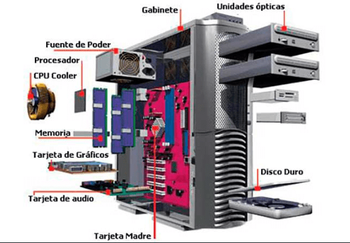
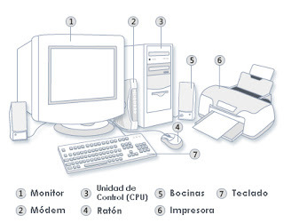

Para conocer más sobre los componentes básicos de una computadora debemos conocer primero qué es una computadora.

Una computadora es una máquina electrónica digital programable que ejecuta una serie de comandos para procesar los datos de entrada, obteniendo información que posteriormente se envía a las unidades de salida. Una computadora está compuesta por numerosos y diversos circuitos integrados y varios elementos de apoyo, extensión y accesorios, que en conjunto pueden ejecutar tareas diversas con suma rapidez y bajo el control de un programa.

Una computadora está compuesta por dos aspectos básicos: el **hardware** que son las piezas y componentes de la computadora y el **software** que son todos los programas y sistemas que tiene el equipo.

Podemos ver al hardware como una caja donde se conectan una serie de dispositivos y componentes que procesan información de entrada y de salida, mientras que el software es el conjunto de instrucciones para ejecutar esa información de entrada y salida. Sin las instrucciones del software, la computadora sería una caja sin utilidad, al igual que lo sería el cuerpo humano sin un cerebro.

## Partes del Hardware 💻

El hardware de la computadora se divide en: **Hardware interno** y **Hardware externo.** A continuación vamos a explicar cada uno de ellos y cómo se componen.

### Hardware interno:

- **Placa base o Tarjeta madre**

Es la placa principal de cualquier sistema informático al que todos los demás dispositivos se conectan, tanto de manera directa (como los circuitos eléctricos interconectados), como indirecta (a través de puertos USB u otro tipo de conectores). Cuenta con un software básico llamado BIOS que le permite realizar y sincronizar sus funciones básicas (como la transmisión de datos, la administración de la energía eléctrica y el reconocimiento de la conexión física de otros componentes externos).

- **Procesador**

Es la Unidad Central de Procesamiento (**CPU**), es decir, el cerebro de la computadora que controla todo lo que ejecuta el ordenador y es responsable de realizar los cálculos y la comprensión de datos. Hay varios tipos de CPU que se diferencian, entre otras cosas, por su velocidad para procesar la información. Esa velocidad se mide en una unidad de frecuencia llamada Hertz (Hz) y, cuanto más rápida es la velocidad alcanzada por el procesador, más rápido será el rendimiento de la computadora. En la actualidad, las dos marcas principales de CPU son AMD e Intel.

- **Memoria Interna RAM**

Es la memoria que almacena información, de manera temporal y rápida, para que la computadora la utilice en el momento. Su capacidad de almacenamiento se mide en unidades llamadas *gigabytes *****(**GB**). A mayor cantidad de memoria RAM, más rápido puede funcionar la computadora. Por ejemplo, para abrir y usar varios programas a la vez. El contenido de la memoria RAM se elimina tan pronto se apaga la computadora porque no almacena datos (archivos, videos, programas, etc.), sino que conserva información sobre las acciones que se están realizando con esos datos. No almacena el archivo o el programa en sí, sino la información para ejecutarlo.

Las memorias ram pueden ser DDR2, DDR3, DDR4 y DDR5 y dependerá del tipo de los slots o puertos de ram que tenga la placa base.

- **Memoria Interna ROM**

Es la memoria que almacena información de manera permanente y que se denomina de “solo lectura”, es decir, el usuario no puede alterar el contenido una vez que se almacenó esa información, solo puede instalarlo o desinstalarlo. La memoria ROM almacena todo lo relacionado con instrucciones o lo que también se denomina **BIOS** (sistema básico o programa de arranque), y que comprende las instrucciones de cómo se inicia la máquina o cómo funcionan los programas, entre otros.

- **Unidad de procesamiento gráfico (GPU)**

También conocida como **tarjeta gráfica** o **tarjeta de video** es un dispositivo de hardware interno que se conecta a la placa madre y permite que la computadora muestre imágenes en el monitor. existen dos tipos de GPU:

1. **GPU integrada - T**ambién llamada “gráficos integrados”, se refiere a que el CPU y la tarjeta gráfica comparten la misma memoria de acceso aleatorio. Esto significa que todas las tareas a ejecutar en el sistema, en conjunto con aquellas de carácter gráfico, son sostenidas por una misma RAM.
2. **Tarjetas gráficas dedicadas -** También llamadas “discretas”, son aquellas que tienen una RAM independiente y que exclusivamente es usada por la GPU. Esta memoria se llama VRAM y mientras más tenga la tarjeta de video podrá ejecutar más tareas visuales al mismo tiempo.

- **Placa de sonido**

Es un dispositivo de hardware interno que se conecta a la placa madre y se clasifica según los canales que utiliza. Por ejemplo: estéreo, cuadrafónico (sonido envolvente), MIDI (conector de uso profesional), entre otros. La función principal de la placa es permitir a la computadora reproducir sonidos a través de altavoces o auriculares. También recibe sonidos del usuario a través de la conexión de un micrófono.

- **Dispositivo de almacenamiento secundario**

Es la memoria que almacena datos de manera permanente (o hasta que el usuario los elimina), como documentos, planillas, imágenes, videos, audios, copias de seguridad de los archivos, entre otros. Son datos almacenados que la computadora no necesita de manera inmediata o rápida para su funcionamiento, sino que es el usuario el que los utiliza de manera directa. Existen dos tipos de dispositivos de almacenamiento secundario: interno (la unidad de disco duro) y externo (disco duro externo, tarjeta de memoria, pendrive, CD ROM, etc.).

### Hardware externo:

- **Dispositivos de entrada**

Son piezas que reciben datos sin procesar y que la computadora puede procesar a través de su software. Se dividen en dos categorías:

1. Dispositivos de entrada manual que deben ser operados por el usuario (teclado, mouse, pantalla táctil, micrófono, etc.) y
2. Dispositivos de entrada automática, que accionan el ingreso de información por su cuenta, de manera independiente del usuario (lector de banda magnética, lector de PIN y chip, lector de código de barras, etc.).

- **Dispositivos de salida**

Son piezas que envían hacia fuera los datos procesados por la computadora. Hay dos tipos: de **salida temporal** como el monitor, que actualiza constantemente la imagen de salida en la pantalla, y de **salida permanente** como una impresora, que reproduce información sobre un papel que perdura como una copia impresa.

- **Dispositivos de almacenamiento**

Estos son dispositivos que permiten grabar la información que generalmente se encuentra en la RAM, y que tanto el usuario como el sistema operativo, disponen de ellos para su trabajo y operación diarios. Podemos considerar a este tipo de almacenamiento como no volátil, es decir, que tanto los programas como los datos no desaparecen, incluso cuando la computadora se apaga. Esto significa, que el usuario puede guardar sus programas e información con la seguridad de que no se borrarán aun cuando la computadora no esté encendida.

Actualmente son varios los dispositivos usados para el almacenamiento de datos de la computadora, entre ellos tenemos:

1. **Disco Duro:**

Un **disco duro** o **disco rígido** es un dispositivo de almacenamiento de datos no volátil que emplea un sistema de grabación magnética para almacenar datos digitales de forma rápida y segura. Es decir, para almacenar datos se utilizan únicamente dos valores representados por 0 y 1 como código binario. Un *bit* es la unidad mínima y elemental utilizada para almacenar información en los discos duros. Como es una unidad muy pequeña se suele utilizar el byte que equivale a 8 bits.

Físicamente un disco duro se compone de uno o más discos (también conocidos como platos) rígidos generalmente de aluminio y recubiertos de una capa de material magnetizable, unidos por un mismo eje que gira a gran velocidad dentro de una caja metálica sellada. Sobre cada plato, y en cada una de sus caras, se sitúa un cabezal de lectura/escritura que flota sobre una delgada lámina de aire generada por la rotación de los discos. En un disco duro magnético la información se guarda en sectores de disco en formato binario organizado por bloques. Por lo tanto, se usa como unidad básica de almacenamiento de información los bytes junto a un prefijo de cantidad. Se ha establecido como acuerdo general la utilización de una **b** para indicar bits, y una **B** para indicar bytes.

Entre los discos duros podemos conseguir:

**1.1** Disco duro Rigido (Hard drive disk o HDD) modelo de 3.5” , con formato de conexión sata y una velocidad de transmisión cercana de datos a 80 MB/s en operaciones de lectura y a 60 MB/s en escritura.

**1.2** Discos duro Solido (Solid State drive o SSD) modelo de 2.5”, con formato de conexión sata y una velocidad de transmisión de datos cercana a 250 MB/s en lectura y a 230 MB/s en escritura de datos.

**1.3** Disco duro Solido M2, modelos de tamaño reducido de 22mm, con un formato de conexión con el bus PCIe 4.0, con una velocidad de transmisión de hasta 10gbps

2. **Memoria Flash:**

El almacenamiento flash es una tecnología de almacenamiento de datos basada en una memoria de alta velocidad que se programa eléctricamente. La velocidad del almacenamiento flash es lo que le dio el nombre: escribe datos y realiza operaciones de entradas y salidas aleatorias a la velocidad del flash.

El almacenamiento flash utiliza un tipo de memoria no volátil que se denomina “**memoria flash**”. La memoria no volátil no requiere alimentación para mantener la integridad de los datos almacenados con lo que, si se interrumpe el suministro, no se pierde nada. Dicho de otro modo, la memoria no volátil no olvida los datos que ha almacenado cuando el disco se desconecta.

Generalmente conseguimos los dispositivos de almacenamiento flash en memorias USB (Universal Serial bus), hoy en contamos con distintos formatos de usb:

- USB 2.0 entre 240 mb/s a 480 mb/s, y los reconocemos por ser de color negro.

- USB 3.0 preparado para recibir 640 mb/s y lo reconocemos por ser de color azul.

3. **Dispositivos periféricos**

Es un dispositivo independiente, conectado externa o internamente a la tarjeta madre, que permite al sistema informático realizar una función extra. Como tal, no forma parte del proceso central de una computadora, sino que sirve a nivel de complemento para aumentar sus capacidades funcionales.

Existen 5 tipos de periféricos de computadora:

| Periféricos de entrada | Aquellos que permiten el ingreso de datos desde el exterior. Ejemplos: mouse, teclado, micrófono y escáner. |
| --- | --- |
| Periféricos de salida | Proyectan la información desde el interior de un sistema informático hacia el exterior. La información proyectada es, por lo general, en formato auditivo, visual o impreso. Ejemplos: pantalla, impresora, altavoces y tarjeta gráfica. |
| Periféricos de entrada/salida (E/S) | Son los dispositivos que pueden tanto recibir como emitir información. Es decir, a diferencia de un periférico de entrada o salida, los dispositivos de E/S pueden cumplir con ambas funciones (recepción y emisión), no limitándose únicamente a una. Ejemplos: pantalla táctil, impresora multifuncional, casco de realidad virtual y módem. |
| Periféricos de comunicación | Elementos físicos que permiten la conexión entre dos o más dispositivos. Ejemplos: tarjeta de red, hub USB, módem, fax y conmutador de red. |

## Arquitectura de computadoras

La arquitectura de la computadora se refiere a una serie de ideas similares dentro de los campos de la informática y la tecnología. A nivel de **software**, se refiere a los sistemas de lenguaje ensamblador que conectan las diversas partes del hardware de la computadora en un solo sistema en funcionamiento. Cuando se trata de **hardware**, se aplica igualmente a los métodos de creación y utilización de hardware y al proceso de construcción de componentes informáticos. Cada una de estas definiciones describe un proceso similar, la idea de comenzar con un sistema informático que no funciona y hacerlo funcional, pero todas miran el proceso desde un punto de vista diferente. En otras palabras, el concepto de arquitectura de computadora se refiere a la integración de su estructura física con su estructura lógica.

La arquitectura de los ordenadores es importante en el sentido de que determina cómo funcionará un ordenador y para qué se puede utilizar. Determina el rendimiento, el consumo de energía, el tamaño y el coste del ordenador.

Una arquitectura de ordenador puede ser una combinación entre hardware y software, o sólo una de las dos. Una arquitectura de hardware es la implementación de la lógica de un ordenador, mientras que la arquitectura de software es la implementación de la funcionalidad de un ordenador. Sin embargo, la arquitectura de software depende en gran medida de la arquitectura de hardware.

### Arquitectura de ordenadores y arquitectura de software

Los términos arquitectura de computadoras y arquitectura de software no son lo mismo y tienen significados totalmente diferentes. Mientras que la arquitectura de los ordenadores es la lógica que dirige un dispositivo físico, la arquitectura del software es la lógica que dirige la funcionalidad de un dispositivo.

Entre los componentes principales de la arquitectura tenemos

1. CPU o procesador.
2. Bus.
3. Memoria principal (Memoria Ram).
4. Sistema de entrada y salida.

> 👉 Existen distintos tipos de arquitectura de datos, entre los cuales contamos con:

| Arquitectura de flujo de datos | Es una arquitectura paralela en la que los datos pasan por las diferentes etapas del cálculo. En esta arquitectura, el resultado de un cálculo se utiliza como entrada para otro cálculo. |
| --- | --- |
| Arquitectura von Neumann | La arquitectura von Neumann es una arquitectura secuencial en la que el cálculo se ejecuta secuencialmente. El cálculo se realiza en un orden secuencial. Esta arquitectura tiene una unidad central de procesamiento (CPU), una memoria y dispositivos de entrada-salida. |
| Arquitectura Harvard | Esta arquitectura es una versión modificada de la arquitectura von Neumann. Tiene dos memorias separadas: una para las instrucciones del programa y otra para los datos. |
| Arquitectura Harvard modificada | Es una combinación de la arquitectura de flujo de datos y la arquitectura Harvard. En esta arquitectura, hay una memoria de programa y una memoria de datos. |

### 💪 **Ejercicio**

Haz una lista con las caracteristicas de la PC que te gustaria armar o no todas las tarjetas madres son compatibles con todos los procesadores, asi que investiga cual es la tarjeta madre ideal para el procesador que te gustaria tener, la cantidad de RAM, el tipo de disco de almacenamiento y si en su arqutectura tambien incluye una tarjeta de video.
