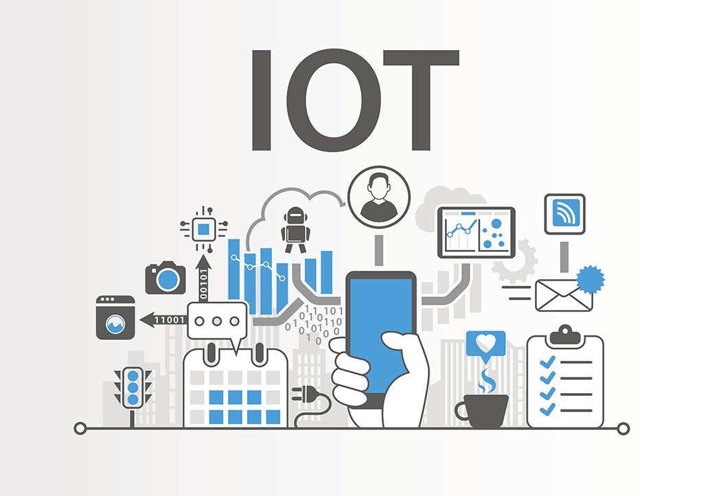
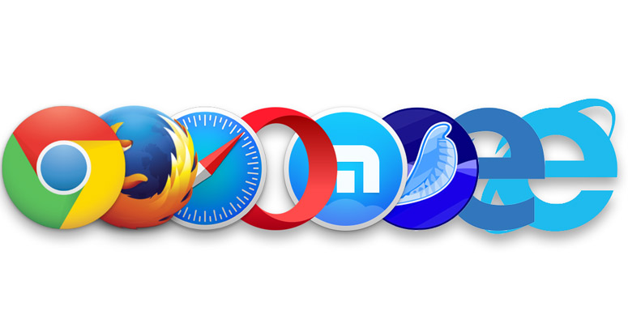

Para tu formación profesional es necesario que sepas que conocer los aspectos básicos de **IT** es muy importante. Recuerda que todo tu trabajo será a través de sistemas de tecnología de información y de comunicaciones, por ello es necesario entrar en contexto y conocer más de lo básico acerca de **IT** y **TIC’s** para avanzar en tu carrera. 

En esta primera lectura entenderás cuáles son los componentes de tu computador, cómo interactúan entre sí, profundizarás en conceptos más técnicos relacionados a tu próximo perfil profesional y también a elementos relacionados a los usuarios. Debes tomar en cuenta que para vencer a un hacker debes **pensar como un hacker** y que los atacantes se anticipan a las nuevas tecnologías para aprovechar el desconocimiento de los usuarios, por eso es importante que tú como profesional en ciberseguridad entiendas a profundidad la informática y la computación como un “todo”. 

Existen muchos tipos de malware (software malicioso) y ataques que van directamente contra un componente físico de una red o un equipo, por lo que si conoces bien cómo funciona un equipo de cómputo entre otras aplicaciones, podrás identificar y mitigar el ataque mucho más rápido.

Seguramente habrás escuchado alguna vez sobre **IT.** El término IT (Information technology o Tecnología de la información) se refiere a todas las tecnologías de información y también se utiliza **TIC** para referirse a tecnologías de información y comunicaciones. Estas tecnologías se  encargan de toda la gestión de la información de un negocio, relacionados con internet, informática y tecnología.

Podemos decir que la tecnología de la información es el proceso de creación, almacenamiento, transmisión y percepción de la información y los métodos de aplicación de estos procesos.

A lo largo de la historia la informática se ha extendido en varias etapas tales como:

- **Informática manual**: Esta época se extiende entre la antigüedad hasta la segunda mitad del siglo XIX. Se caracterizaba por el hecho de que toda la información estaba mediada por el papel y la persona.
- **Era de la informática mecánica:** Con las innovaciones tecnológicas de finales de siglo XIX empieza esta etapa que se extiende hasta el día de hoy. Aunque se mantiene el objetivo de una comunicación clara, se implementan métodos más sencillos y eficaces como el teléfono.
- **Informática eléctrica:** Desde 1940 a 1960 se empieza a darle énfasis al contenido en vez de la forma. Aquí ya aparecen los primeros equipos y programas informáticos.
- **Etapa de la electrónica:** A partir de los 70s, aparecen los sistemas de control automatizados (SCA), y los sistemas de recuperación de la información (SRI). Esto lleva a una sofisticación de los equipos, y se empieza a pensar en una informática con hincapié en la creación de información significativa.

En la actualidad vivimos en una era de digitalización donde todos los procesos productivos y del día a día se pueden realizar de una manera sencilla. Por ejemplo, gracias a la tecnología toda nuestra información es almacenada en servidores dentro de la internet, lo que hace que comunicarnos con las personas sea fácil. El campo IT hoy en día es uno de los campos con más importancia y crecimiento.

**Algunos conceptos básicos referentes al IT que podemos conseguir son:**

| Informática | Es el conjunto de conocimientos científicos y técnicas que hacen posible el tratamiento automático de la información por medio de ordenadores. |
| --- | --- |
| **Hardware** | Son los elementos físicos o materiales que forman parte de un ordenador o cualquier otro dispositivo informático, como puede ser el disco duro, la memoria RAM o la tarjeta madre. Dentro del hardware podemos conseguir dos grupos: **La CPU o Unidad Central de Proceso:** Es la que controla todo lo que ocurre en el ordenador, la que hace posible que se ejecuten las diferentes órdenes que introducimos. Junto con ella, también están los demás elementos que se encuentran en el interior, como la memoria RAM, la tarjeta de sonido o la tarjeta gráfica. Por otra parte **Los Periféricos:** Pueden ser de entrada, que permiten introducir información al ordenador (como el teclado, un escáner o el ratón); o de salida, que hacen posible que el ordenador nos devuelva la información (por ejemplo, un monitor, unos altavoces o una impresora). |
| **Software** | Sería la parte intangible, los distintos programas y aplicaciones que el usuario utilizará para determinadas funciones como procesadores de texto o videojuegos y el sistema operativo que lleve instalado el dispositivo como Windows, GNU/Linux o MacOS. El sistema operativo hará posible el funcionamiento del sistema, y cada uno tendrá una serie de características, como un diseño propio o funciones exclusivas. |
| **Memoria RAM** | Es la memoria de acceso aleatorio o Random Access Memory y en ella, el dispositivo almacena temporalmente los datos que necesita para trabajar, cuanta más memoria RAM tenga el ordenador, su funcionamiento será más fluido, permitiendo una multitarea más efectiva. |
| **Memoria ROM** | Es la memoria de sólo lectura o Read Only Memory, donde están almacenadas las instrucciones básicas del procesador. |
| **Disco duro** | Es donde se almacena la información en nuestros equipos informáticos, la capacidad de almacenamiento se mide normalmente en gigas (Gb).  Hasta hace poco tiempo se utilizaban los discos duros HDD (Hard drive disk), pero en los últimos años se han popularizado los SSD (Solid state disk), que permiten un acceso mucho más rápido a la información y un mejor funcionamiento general del ordenador. |
| **Lenguajes de programación** | Los lenguajes de programación son un conjunto de reglas que permiten al humano interactuar con el computador para darle instrucciones y obtener una respuesta. Hablaremos de ellos más profundamente en los siguientes párrafos. |
| **IoT (Internet de las Cosas)** | El IoT (Internet of Things), o internet de las cosas, es una nueva tendencia tecnológica que consiste en dotar a dispositivos y aparatos de la capacidad de comunicarse con el usuario y entre ellos. Gracias al uso de sensores, conexiones de red, software y otras tecnologías, elementos y dispositivos tradicionales como relojes y electrodomésticos, entre otros, intercambian información. |

## Lenguajes de programación

Los lenguajes de programación son un conjunto de reglas que permiten al humano interactuar con el computador para darle instrucciones y obtener una respuesta. Existen dos tipos de lenguajes de programación: **Lenguajes de bajo nivel** y **lenguajes de alto nivel**. 

### **Lenguajes de Bajo Nivel:**

Los lenguajes de bajo nivel son aquellos que están más cerca del **hardware** y permiten un control detallado sobre el sistema. Estos lenguajes suelen estar más directamente relacionados con la arquitectura del procesador y la memoria de la computadora. Algunos ejemplos de lenguajes de bajo nivel son:

1. **Lenguaje Ensamblador (Assembler):** Este lenguaje se encuentra directamente asociado con las instrucciones específicas del procesador. Cada instrucción en lenguaje ensamblador se traduce a una instrucción de máquina única.
2. **Lenguaje de Máquina:** Estos son los códigos binarios directamente entendidos por la CPU. Cada instrucción y dato se representa en una forma numérica específica.

> 💡 Es importante mencionar que la línea que separa los lenguajes de bajo nivel y los lenguajes de nivel medio puede ser difusa en algunos casos, ya que existen lenguajes que ofrecen un nivel de control cercano al hardware sin llegar a ser completamente de bajo nivel.

### Lenguajes de Alto Nivel:

Los lenguajes de programación de alto nivel se asemejan más al lenguaje humano y a diferencia de los lenguajes de bajo nivel, estos actúan por encima del hardware enfocándose directamente en el software; aunque existen lenguajes de programación de alto nivel como C o C++ que tienen lo mejor de los dos mundos. Algunos especialistas los sitúan como lenguajes “**nivel medio**” ya que pueden actuar en el bajo nivel y también en el alto nivel. 

> ⚠️ Muchos tipos de malware son programados bajo lenguaje **C**, **C++** y **Python**. PHP, Javascript, Ruby y otros lenguajes populares en la industria están más asociados a aplicaciones a nivel de usuario.

**Ejercicio: Investiga el uso en ciberseguridad de los siguientes lenguajes de programación: C, C++, PHP, Python, JavaScript, Ruby.**

## Internet of Things (Internet de las Cosas)

El **IoT** (Internet of Things), o internet de las cosas, es una nueva tendencia tecnológica que consiste en dotar a dispositivos y aparatos de la capacidad de comunicarse con el usuario y entre ellos. Gracias al uso de sensores, conexiones de red, software y otras tecnologías; elementos y dispositivos tradicionales como relojes y electrodomésticos, entre otros, intercambian información.

Con la llegada de **IoT** en la que pasamos de solo conectar computadores y móviles a internet a conectar relojes, lavadoras, consolas de videojuegos entre otros electrónicos; llega un nuevo fenómeno conocido como el “*big data”*. Definimos **big data** como un conjunto de datos masivos y voluminosos generados desde diferentes fuentes. Cuanto más digitalizado está el mundo más datos se generan por segundo. Alguien debe mantener segura toda esta información, por ello la demanda de profesionales en ciberseguridad va en aumento.

> *El concepto de IoT es uno de los tantos con el que debes estar familiarizado ya que en tu primer día trabajando en ciberseguridad podrías llegar a una empresa que cuenta con una red de IoT.*

### Internet: La red de redes 🌎

En un mundo donde la comunicación se limitaba a distancias geográficas, un nuevo horizonte comenzó a tomar forma. Esta es la historia de Internet, una revolución que conectó a la humanidad como nunca antes. A mediados del siglo XX, visionarios como J.C.R. Licklider soñaban con redes interconectadas. La semilla fue sembrada y en 1969, nació el embrión de la red: ARPANET.

ARPANET unió a universidades y centros de investigación en una tela digital. Pero fue Tim Berners-Lee quien agregó un nuevo capítulo, al inventar la World Wide Web en 1989.

Con la Web, la información se convirtió en algo accesible para todos. Aparecieron navegadores como Netscape y Explorer, abriendo la puerta a un mundo en línea de posibilidades infinitas.  El nuevo milenio trajo consigo un auge tecnológico. Las redes sociales emergieron, transformando la forma en que las personas se conectan y comparten. Luego, los dispositivos móviles ingresaron al escenario. Los smartphones llevaron Internet a los bolsillos de todos, creando una sociedad permanentemente conectada.

La nube se convirtió en el refugio digital, almacenando datos y permitiendo servicios remotos. grandes data centers se levantaron como pilares del ciberespacio. El comercio electrónico floreció, y junto a él; las criptomonedas como **Bitcoin** desafiaron las nociones convencionales de moneda y valor. La expansión no tuvo límites. La realidad virtual llevó la experiencia en línea a nuevas dimensiones, y la brecha digital se cerró lentamente, conectando incluso a regiones remotas.

Sin embargo, con la promesa de avances, surgieron desafíos. La ciberseguridad se convirtió en una prioridad urgente, enfrentando amenazas y ataques incesantes.

Pero incluso en medio de los desafíos, Internet demostró su capacidad para unir a la humanidad. La colaboración en línea creció, y tecnologías emergentes como la inteligencia artificial prometieron un futuro aún más emocionante.

Y así, la historia de Internet continúa, una narrativa en constante evolución que sigue conectando corazones y mentes a través de los océanos digitales.

### 🌐 La web: El alma de internet

En un mundo donde las distancias parecían inquebrantables, una innovación revolucionaria comenzó a tejer una nueva red de posibilidades. Esta es la historia de la World Wide Web, un cambio que transformó la forma en que compartimos y accedemos a la información.

A finales del siglo XX, un científico llamado Tim Berners-Lee, que trabajaba en el CERN en Suiza, buscaba una manera de conectar y compartir información de manera más eficiente.  En 1989, Berners-Lee presentó su idea: una "red de información" que permitiría a las personas crear, compartir y enlazar documentos. Así nació el primer **sitio web** y el lenguaje **HTML**, el ladrillo fundamental de la web moderna.

A medida que la década de 1990 avanzaba, la Web creció exponencialmente. Surgieron navegadores como Netscape y Explorer, abriendo puertas digitales para millones. El mundo en línea se convirtió en un nuevo territorio para la creatividad. Las empresas lanzaron sitios web, el comercio electrónico comenzó a despegar y una nueva economía digital tomó forma.

A principios de los 2000, la web evolucionó aún más. Plataformas como Friendster y MySpace introdujeron la noción de redes sociales en línea, cambiando la forma en que interactuamos y compartimos nuestras vidas.

Luego, con la llegada de los dispositivos móviles, la web se volvió más accesible que nunca. Aplicaciones como Facebook y Twitter transformaron los smartphones en ventanas a un mundo siempre conectado.

Hoy, la Web es un vasto ecosistema de información, donde millones de sitios y servicios abarcan temas desde la educación hasta el entretenimiento. Y mientras avanzamos, tecnologías emergentes como la realidad virtual y la inteligencia artificial están dando forma a una nueva era de experiencias en línea.

En la siguiente tabla, se encuentran algunos términos fundamentales en la industria de la tecnología y el desarrollo de software; cada uno desempeña un papel importante en la creación y entrega de aplicaciones y servicios en línea.

| FrontEnd | El FrontEnd es la parte de un sitio web o aplicación con la que los usuarios interactúan de forma directa, y está compuesta por: menú, botones, campos para introducir datos, textos informativos y otros elementos necesarios. |
| --- | --- |
| BackEnd | El BackEnd es la parte del desarrollo web que se encarga de que toda la lógica de una página web funcione. Se trata del conjunto de acciones que pasan en una web, pero que no vemos como, por ejemplo, la comunicación con el servidor. |
| DevOps | DevOps (acrónimo inglés de development and operations) es una metodología de trabajo para el desarrollo de software que favorece el trabajo colaborativo y que tiene como objetivo entregar al cliente un producto de mayor calidad de forma mucho más rápida. |
| SaaS | El software como servicio o SaaS (Software as a Service) en un servicio que permite el acceso a aplicaciones que se ejecutan en la nube. Los proveedores SaaS ofrecen acceso a empresas y usuarios a software que se ejecuta en sus servidores y a los que pueden acceder de forma remota, utilizando su navegador web, por ejemplo. Los servicios SaaS son cada vez más comunes en el entorno laboral por los grandes beneficios que aportan. |

## Importancia de la IT en las empresas

Hoy en dia es dificil discutir la importancia de la tecnología de la información en las empresas, ya que de ellas depende gran parte de la operatividad diaria, la optimización de recursos de todo tipo y la protección de datos sensibles; pensar en una organización o empresa que funcione sin un equipo de ingeniería en computación e informática es casi improbable.

Algunas de las funciones que dependen de las competencias del equipo informático en las empresas son las siguientes:

- **Automatización de procesos**: La labor de los encargados de esta área es generar soluciones destinadas a mejorar la experiencia del usuario, tales como pagos, servicios de facturación y control de almacenes, lo que representa un ahorro de tiempo y dinero. Esto permite a los colaboradores mantenerse enfocados en lo estrictamente relacionado con el producto o servicio de la empresa.
- **Protección de datos**: otra de las tareas fundamentales de un departamento de IT es desarrollar sistemas de ciberseguridad que no únicamente mantengan los datos de la empresa a salvo de amenazas virtuales, sino que también resguarden la información de clientes, proveedores y colaboradores.

La capacidad para generar soluciones de software, encargarse de su implementación y mantenimiento son algunas de las habilidades de un informático que garantizan oportunidades de crecimiento profesional, por ejemplo, en el diseño y evaluación de proyectos relacionados con las tecnologías de la información.

La tecnología de información puede resultar muy beneficioso para las empresas, ya que entre sus objetivos principales son facilitar y simplificar diversos procesos, esto nos puede generar grandes ventajas como:

- El ahorro de dinero y tiempo para realizar estas tareas.
- Brindar una mejor seguridad a la hora de almacenar información.
- Facilitar la comunicación entre los compañeros de trabajo.

## Responsabilidades y roles en IT

Muchas empresas tienen departamentos dedicados a satisfacer sus necesidades de tecnología de la información (TI). Esto generalmente se debe a que necesitan un acceso constante y confiable a los sistemas informáticos y los diversos beneficios que estos ofrecen. Por ello, una vez que una empresa alcanza un cierto tamaño, generalmente se vuelve necesario que tenga su propio departamento de TI.

Por lo general, el departamento de TI de una empresa tiene tres áreas principales de trabajo:

1. Los sistemas tecnológicos de la empresa.
2. El mantenimiento de su infraestructura digital.
3. Garantizar que todos los sistemas funcionen juntos de manera efectiva.

También suelen ocuparse de las necesidades de hardware y software de una empresa, que a menudo son utilizadas por parte del personal fuera del departamento de TI.

### Roles en TI

Hay muchos roles diferentes en un departamento de TI. Algunos de los más comunes e importantes son los siguientes:

- **Técnico de hardware**: Estas personas reparan y mantienen el hardware de una empresa, como servidores y computadoras. Esto puede extenderse a la instalación, adquisición, seguridad y mantenimiento de sistemas informáticos.
- **Ingeniero de redes**: Es el responsable de diseñar y desarrollar las redes de una empresa. Estas personas suelen trabajar en estrecha colaboración con los administradores y gerentes de red.
- **Administrador de red**: Una vez que un ingeniero de red ha desarrollado una red, el administrador de red la supervisa y mantiene para su uso.
- **Gerente de proyectos de TI**: Estas personas son responsables de desarrollar e implementar proyectos de tecnología de la información que beneficien a una empresa. Esto generalmente incluye todo, desde el presupuesto hasta la asignación de tareas.
- **Arquitecto de ciberseguridad**: También llamados arquitectos de seguridad, estos individuos diseñan y desarrollan los sistemas de seguridad digital de una empresa. Estos sistemas de seguridad protegen los datos de la empresa y otra información importante que se almacena digitalmente.

### Responsabilidades que tiene el departamento TI

1. **Administración**

La administración de las TI implica el mantenimiento y reparación de los sistemas tecnológicos de la empresa, asesorando sobre nuevas soluciones y ayudando a los distintos departamentos a instalar y utilizar nuevos equipos.

Estas tareas a menudo se superponen con las de otros de sus colegas en el departamento, como los administradores de sistemas y los administradores de red

Las responsabilidades más comunes de los administradores de TI incluyen:

- Mantenimiento de la infraestructura informática y digital de una empresa.
- Gestión de las necesidades de almacenamiento de datos de una empresa.
- Evaluación de amenazas potenciales a la infraestructura digital de la empresa.
- Seguimiento de los contratos actuales con los clientes.
- Asegurar el cumplimiento de los estándares de calidad de la empresa.

2. **Soporte Técnico**

El personal de soporte técnico ofrece asistencia al personal que necesita acceso a los sistemas informáticos de la organización. Esto puede implicar ayudar a solucionar problemas relacionados con el **software** y el **hardware**.

Los deberes del soporte técnico suelen incluir lo siguiente:

- Solución de problemas con el hardware y el software de la empresa.
- Creación de registros de trabajo.
- Reparar o reemplazar hardware dañado o defectuoso.
- Instalación de equipos para videoconferencias y audioconferencias.
- Instalación y configuración de equipos de oficina como impresoras y copiadoras.
- Solución de problemas de red y conectividad.
- Copia de seguridad y recuperación de los activos digitales de una empresa.
- Instalación y mantenimiento de servicios basados en la nube.

3. **Comunicaciones**

Facilitar la comunicación entre distintos miembros del equipo de trabajo puede ayudar mucho a reducir los problemas logísticos, por ello es importante apoyarse en los métodos digitales de comunicación.

Por ejemplo, hoy en día, gran parte de las reuniones y entrevistas entre candidatos, clientes y altos directivos deben organizarse utilizando tecnologías de videoconferencia.

Debe existir personal capacitado dentro del departamento de TI que administre toda la infraestructura necesaria para hacer posible estas comunicaciones.

Esto generalmente incluye:

- Preparación del hardware y el software para conferencias de vídeo y audio.
- Actuar como consultores técnicos para el personal y la administración.
- Gestión de las cuentas de usuario y los protocolos de inicio de sesión de la empresa.
- Mantenimiento de registros y copias de seguridad de reuniones importantes y fuentes de datos.
- Carga de nuevos datos en el sistema en línea de la empresa.
- Mantenimiento y solución de problemas de los sistemas de correo electrónico de la empresa.
- Configuración de llamadas y videoconferencias.
- Ofrecer soporte a los usuarios de aplicaciones de comunicación digital.

4. **Programación**

Las necesidades de una empresa pueden incluir a personal de desarrollo de software ya que parte de los sistemas que utiliza son desarrollados por ella misma. Estos especialistas crean nuevas piezas de software basadas en las necesidades de la empresa, en lugar de comprar paquetes de software.

Los roles de los programadores y desarrolladores en un departamento de TI a menudo incluyen:

- Desarrollo de aplicaciones de software dedicadas para la empresa.
- Desarrollo y mantenimiento de bases de datos para la empresa con software específico.
- Codificación en lenguajes como JavaScript, HTML/CSS, SQL, Python y C++.
- Convertir documentos y otros archivos en varios formatos.
- Uso de aplicaciones de edición gráfica y visualización de datos para copiar, editar y desarrollar gráficos.
- Utilizar sus conocimientos para ayudar a la empresa a desarrollar nuevas soluciones.

5. **Aplicaciones**

Algunas empresas quieren desarrollar aplicaciones específicas que aumenten la participación del usuario con la organización. También puede que estas aplicaciones sean uno de los productos propios de la compañía.

En estos casos, las empresas necesitan contar con desarrolladores de aplicaciones dedicados para diseñar nuevas aplicaciones basadas en las solicitudes de los clientes o las necesidades de los consumidores.

Las funciones del personal de desarrollo de aplicaciones suelen incluir:

- Evaluación de las necesidades de los consumidores o clientes que usarán las aplicaciones.
- Conversión de las necesidades de los clientes en aplicaciones de software viables.
- Análisis de viabilidad de actualizaciones y requisitos.
- Desarrollo del código que realiza tareas específicas.
- Desarrollo de manuales de usuario y otros medios para ayudar a los usuarios a operar sus aplicaciones.
- Solución de problemas, pruebas y control de calidad para nuevas aplicaciones.
