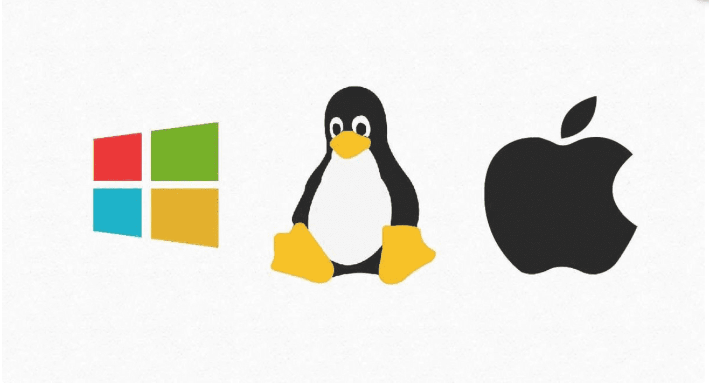
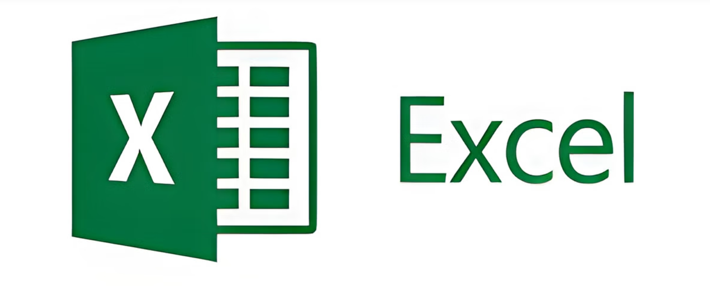
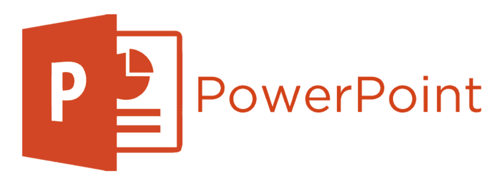

The **operating system** is the **software** that coordinates and directs all the services and applications a user utilizes on a computer, making it the most fundamental. These are programs that enable and regulate the most basic aspects of the system.

Operating systems consist of graphical interfaces, desktop environments, or window managers that provide the user with a graphical representation of running processes. It can also be a command line, i.e., a set of instructions ordered by priority and functioning based on commands entered by the user.

### Among the most well-known operating systems are:

- **Windows**

Windows is an operating system developed by the American company Microsoft. Emerging during the 80s, its popularity was such that it reached a 90% market share of operating systems worldwide. Its most notable feature (from which it gets its name) is a graphical interface based on window navigation (tasks), leaving behind script sequences and achieving tremendous success.

Microsoft has included specific applications developed within the operating system, such as a web browser, video player, and security program.

Windows is one of the most popular operating systems on the market. With various versions available, such as Windows 8, Windows 10, and Windows 11, it currently holds around 70% of the operating system market.

- **macOS**

macOS is an operating system designed by Apple that is installed on all devices created by Apple Inc., generally known as **Mac**.

The operating system is what allows you to perform all tasks on a computer, such as gaming, listening to music, viewing and editing images, among many other things.

Unlike the Windows operating system that can be used on devices from different manufacturers (DELL, Lenovo, etc.), macOS is specifically designed for computers manufactured by Apple. This means that hardware and software are fully compatible, resulting in better performance and faster information processing.

MacOS is an operating system designed by Apple that is installed on all devices created by the company Apple Inc., generally known as Mac.

- **Linux**

GNU/Linux (officially pronounced as ñu Linux or also ge-ene-u Linux in Spanish) is a family of Unix-like operating systems composed of free and open-source software. GNU/Linux arises from the contributions of various software projects, with notable contributions from GNU (initiated by Richard Stallman in 1983) and the Linux kernel (initiated by Linus Torvalds in 1991).

Although in everyday language most people use the term Linux to refer to this operating system, it is just the name of the kernel, representing less than 50 percent of all the system's code. The complete system also includes numerous components from the GNU Project alongside third-party components, ranging from compilers to desktop environments. It should be noted that some derivatives use the Linux kernel but do not have GNU components, such as the Android operating system. There are also GNU software distributions where the Linux kernel is absent.

GNU/Linux operating systems are normally available in the form of compilations known as distributions or distros. Among the most popular are Debian, Ubuntu, Red Hat, and Kali Linux. The purpose of these distributions is to offer GNU/Linux as a final product for installation or testing on a computer, covering a range of needs from everyday personal use to very specific applications in specialized environments. The distros add their selection of preinstalled applications and programs (for example, X11-based graphical environments, Gnome and KDE), or applications that can be downloaded from a repository for later installation.

- **For Linux:**

1. From any Linux distribution, open the terminal and enter the command **lscpu.**
   
    > This command will return a list ranging from the system architecture, processor, cores, and threads to more interesting information such as the list of active vulnerabilities in the system.
   
2. In the terminal, enter the following command **sudo dmidecode -- type memory | less.**
   
    > This command will return a detailed list of the motherboard, model, architecture, and all ports that are in use, along with a description of the RAM, such as slots and details of each memory.
   
3. In the terminal, add the command **sudo dmidecode -t 16.**
   
    > This command will return a list that includes the maximum amount of RAM that the motherboard can support.

- **For MacOS:**

1. From the Mac terminal, enter the following command **uname -a (all).**
   
    > It will list all system information, from the type of architecture, processor, and memory to the terminal and BIOS versions.

> 👉 It is important to have access to this information, as the hardware components of your system may have vulnerabilities that attackers could exploit. Keeping your system up-to-date and secure is essential to protect it against potential threats.

In 2023, the hardware brand GIGABYTE reported a BIOS-level vulnerability with software running a program on the PC that allows controlling and downloading updates without the user's knowledge. This software could enable an attacker to install malware that runs when the PC is turned on.

In 2022, the brand Intel reported 16 vulnerabilities in its processors, including the 9th, 10th, and 11th generation processor families, which have such a significant impact on security that they could bypass all measures imposed by hardware or software.

With these cases, it is understood how important it is to know the characteristics of PCs to understand which vulnerabilities can be exploited or need protection.

## Productivity Applications: Getting to Know Our Users

**What Are They?**

Productivity applications are digital tools that allow users to increase their productivity by organizing, managing, and executing everyday tasks.

Among the most widely used productivity applications, we find word processors, spreadsheets, and presentation software. Let's take a closer look at:

1. **Word Processor**

A word processor is a computer application that allows users to create and edit text documents. It is a multi-functional software for writing, offering various fonts, font sizes, colors, paragraph types, artistic effects, and other options.

Word processors perform a function similar to what typewriters did a few decades ago, albeit much more comprehensive and complex. In a typewriter, for example, each letter typed by the user was immediately printed on paper, making it impossible to erase.

**Among the most well-known word processors are:**

- Microsoft Word

Perhaps the most popular worldwide, Word is the most comprehensive word processor today. It is designed to help create professionally formatted documents, with the best document formatting tools, aiding in organizing and writing documents more effectively.

> 👉 Word is a paid software, used under the purchase of a usage license.

- Apache OpenOffice Writer

Writer has everything you would expect from a fully equipped modern word processor. Its use is entirely free, as it is open-source licensed.

Simple enough for a memo and powerful enough for creating books with content, images, diagrams, indexes, etc. Writer can also display multiple pages while editing, making it ideal for modifying complex documents or if you have a large monitor or multiple monitors.

1. **Spreadsheets**

A spreadsheet is a type of document that allows the manipulation of numerical and alphanumeric data arranged in tables composed of cells, which are usually organized in a matrix of rows and columns.

The cell is the basic unit of information in the spreadsheet, where values and formulas that perform calculations are inserted. It is usually possible to perform complex calculations with formulas and/or functions and create different types of charts.

**Among the most popular spreadsheets are:**

- Microsoft Excel

Excel, is one of the quintessential spreadsheet programs used in small and large companies and most offices.

These sheets can be created with templates and additional tools that make the process and work in general easier. In this program, you can insert bar charts, pie charts, line charts, and more. It has pivot tables, which analyze large amounts of data and then present quite complex reports without having to write formulas.

- Google Sheets

This is a spreadsheet program included as part of the free web-based Google Docs Editors offered by Google.

The application is compatible with Microsoft Excel file formats and allows users to create and edit files online while collaborating with other users in real-time. Edits are tracked by the user with a revision history that shows changes.

1. **Presentation Applications**

A presentation program is a type of software or computer application used to present information through a set of slides.

Typically, a presentation program includes three main functions:

- An editor that allows the insertion of text and formatting.
- A method for inserting and manipulating images and graphics.
- A system for displaying content in a continuous form.

**Among the most well-known are:**

- Microsoft PowerPoint

This tool is part of the Microsoft Office software package, where we can create presentations. It also has the option to customize and add animations to the presentations. Since it is fully integrated with other tools in the Microsoft Office suite, content created with Excel or Word can be imported into PowerPoint, as well as other media such as images, audio, and video clips.

Additionally, it offers a series of templates to provide the user with predefined designs for different purposes.

During a Microsoft PowerPoint presentation, the presenter has the freedom to define the pace by controlling the flow of slides manually or having them change at preset intervals.

- Google Slides

Google Slides or Google Presentations is a service that allows you to create online visual support for your presentations. You can create and edit your slides individually or as a team, through a computer, a mobile phone, or a tablet.

To access this application, you can do so through the Google Slides website. There, you can create and share a new Google presentation, view available templates, and access your recent presentations. All modifications made to a presentation will be automatically saved.

## **Security Software**

Computer security software is a set of tools that minimize risks from network threats and ensure the security of the data we handle at both personal and business levels.

There are different types of security software, including:

- **Antivirus**

Computer antivirus programs are application software designed to detect and remove computer viruses from a computer system. In other words, it is a program that aims to remedy the damage caused by these invasive forms of software, whose presence in the system is often undetectable until their symptoms become evident, similar to biological viruses.

These pieces of software can be purchased through various commercial programming companies to ensure the monitoring, cleaning, and protection of computers.

Generally, these antivirus programs offer active monitoring services to prevent the total access of an infected document to the system, block insecure websites, and eliminate risky files as soon as they enter the computer. This is often referred to as active protection.

On the other hand, antivirus programs also deal with other unwanted pieces of software, such as spyware, malware, or rootkits, and even hacking attempts. To do this, they have a firewall (remote connection blocking software) and a virus definition database, which is a kind of encyclopedia of known viruses.

Some computer security programs used to protect computers against viruses and other online threats include:

1. Norton.
2. Bitdefender.
3. McAfee.
4. Windows Defender.

- **Firewall**

A network security system for computers that restricts incoming, outgoing, or inter-network traffic.

This dedicated hardware and software unit works by selectively blocking or allowing data packets. Its purpose is typically to prevent malicious activity and prevent anyone (inside or outside the private network) from unauthorized web activities. Firewalls can be considered as boundaries or gates that manage the flow of web activity allowed or prohibited in a private network.

The term comes from physical walls acting as barriers to slow the spread of fire until emergency services can extinguish it. In comparison, network security firewalls serve to manage web traffic and are typically intended to slow down the spread of web threats.

Firewalls create "bottlenecks" to channel web traffic. At these points, a review is conducted based on a set of programmed parameters, and actions are taken accordingly. Some firewalls also track traffic and connections in audit logs to check what has been allowed or blocked.

A firewall is designed to control or filter which communications are allowed in and which are allowed out of a device or network. A firewall can be installed on a single computer to protect that computer (host-based firewall) or can be a stand-alone network device that protects an entire network of computers and all host devices on that network (network-based firewall).

**Exercise:** Investigate the different types of firewalls that exist and their configuration.

## 🔎 Lab

**Discover how to view information about your hardware on your computer:**

- **For Windows:**

1. Press **`win + r`** on your keyboard and enter **msinfo32** in the window to view internal information such as the processor, software version, and amount of **RAM**.

2. Press **`win + r`** on your keyboard and enter **cmd** in the window. It will open the Windows terminal, and enter the command **systeminfo**; you will get information from the hostname to the BIOS version.

3. In the same terminal, enter the command ***wmic memphysical get MaxCapacity***, ***MemoryDevices.***

    > The command will return the maximum amount of RAM supported by the motherboard and the number of available slots. This is a very useful command if you plan to upgrade your computer's RAM. The maximum amount (MaxCapacity) is expressed in Kb, so you will have to divide by 1024 to transform it into Mb and again divide by 1024 to get the amount in Gigabytes.
