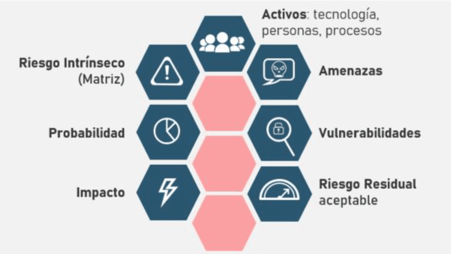

# Lectura 3 📕: Identificación y evaluación de riesgos

Es momento de entrar un poco más en profundidad dentro de una de las partes más importante del marco de ciberseguridad de NIST, y es la primera función que es identificación y evaluación de riesgos en una organización.

En esta etapa hacemos la identificación de las amenazas potenciales que puedan afectar los activos de información, así como las vulnerabilidades existentes en los sistemas y procesos de una organización, para ello realizamos procesos como análisis de riesgos, revisión de seguridad y evaluación de vulnerabilidades.

Vamos a explicar un poco más detallado en qué consiste cada proceso:

- **Proceso de identificación y clasificación de activos.**

En esta etapa, nos centramos en la identificación y clasificación de los activos de una organización, de esta manera podremos saber cuáles son los activos más importantes y valiosos, estos pueden incluir: datos confidenciales, infraestructura de red, aplicaciones, hardware, software y cualquier otro elemento que sea importante para el funcionamiento de la empresa.

El primer paso para realizar este proceso es realizar un inventario exhaustivo de todos los activos de información, recopilar información detallada sobre cada activo como su ubicación o su propietario, su función y su importancia para la organización.

Después a tener este inventario, es necesario realizar una clasificación, según su importancia y valor para la organización, esta clasificación de activos nos permitirá priorizar los recursos y esfuerzos de seguridad en función de la importancia de cada activo, como por ejemplo, no será el mismo enfoque a la seguridad que le daremos a los servidores de la organización, que a los dispositivos de una red de invitados.

Todos los activos deben entrar dentro de la clasificación de esta manera podemos saber:

- Cuáles dispositivos y sistemas son necesarios para el funcionamiento de la organización
- Cuáles plataformas o aplicaciones de software son más requeridos para la organización
- Cuáles son los sistemas de información externos para el funcionamiento de la organización
- Cuáles son las rutas de comunicación y flujo de datos para el funcionamiento de la organización

Comúnmente se usará una escala de clasificación como alta, media y baja para asignar los niveles de importancia de los activos. Los activos de alta importancia son aquellos que, sí se ven comprometidos, podrían tener un impacto significativo en la organización, mientras que los activos de baja importancia son aquellos que tienen un mínimo impacto.

En algunos casos nuestro trabajo como analista de ciberseguridad es realizar este inventario y clasificarlo en concordancia a las necesidades y objetivos de la organización así como administrar estos activos para las necesidades y objetivos actuales y futuras.

- **Análisis de riesgos y evaluación de impacto.**

Esta parte del proceso de identificación y evaluación de riesgos se centra en comprender el impacto que un incidente de seguridad podría tener en la confidencialidad, integridad y disponibilidad de la información.

El análisis de riesgo implica identificar las amenazas potenciales que podrían afectar los activos de información, así como las vulnerabilidades existentes en los sistemas y procesos de una organización, así como también entender cómo estas amenazas podrían afectar la misión, función, imagen, reputación, activos e individuos dentro de una organización.

Para lograrlo podemos hacer varios procesos como la evaluación de los activos vulnerables de la organización e identificar y documentar esos activos. También para saber el alcance de una amenaza podemos acudir a fuentes externas de la empresa para recolectar información de cómo tratar con dicha amenaza, por ejemplo: Compartir información dentro de foros y discusiones de ciberseguridad.

De acuerdo a estos análisis podemos determinar cuáles son las prioridades, tolerancias de riesgos y otras suposiciones que mejor encajen a nuestros requerimientos dentro de la empresa.

Estos procesos de análisis de riesgos y evaluación de impacto son procesos continuos. A medida que evolucionan las amenazas y cambian los entornos de seguridad, es necesario revisar y actualizar regularmente estos procesos para así, garantizar que la organización está preparada para enfrentar los nuevos desafíos.

- **Evaluación de vulnerabilidades y amenazas.**

La evaluación de vulnerabilidades implica identificar las debilidades y fallos de seguridad en los sistemas, redes y aplicaciones de una organización. Esto se puede lograr mediante la realización de pruebas de penetración, análisis de código, escaneos de vulnerabilidades y revisiones de configuración. El objetivo es identificar las vulnerabilidades que podrían ser aprovechadas por un atacante para comprometer la seguridad de los activos de información.

En este proceso también se busca identificar y comprender las amenazas potenciales que podrían afectar a una organización. Esto incluye amenazas internas y externas, como ataques cibernéticos, malware, phishing, ingeniería social, desastres naturales, entre otros. Es importante tener en cuenta que las amenazas pueden evolucionar con el tiempo, por lo que es necesario mantenerse actualizado sobre las últimas tendencias y técnicas utilizadas por los atacantes.

Una vez que se han identificado las vulnerabilidades y las amenazas, se procede a evaluar su impacto potencial en los activos de información y en la organización en general. Esto implica determinar la probabilidad de que una vulnerabilidad sea explotada y el impacto que tendría en la confidencialidad, integridad y disponibilidad de los activos. Esta evaluación de impacto ayuda a priorizar los esfuerzos de mitigación y a tomar decisiones informadas sobre las medidas de seguridad que deben implementarse.